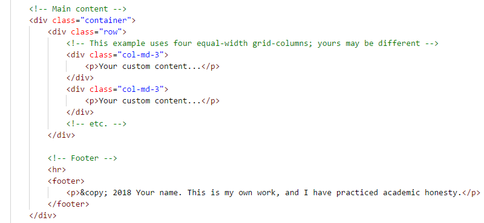
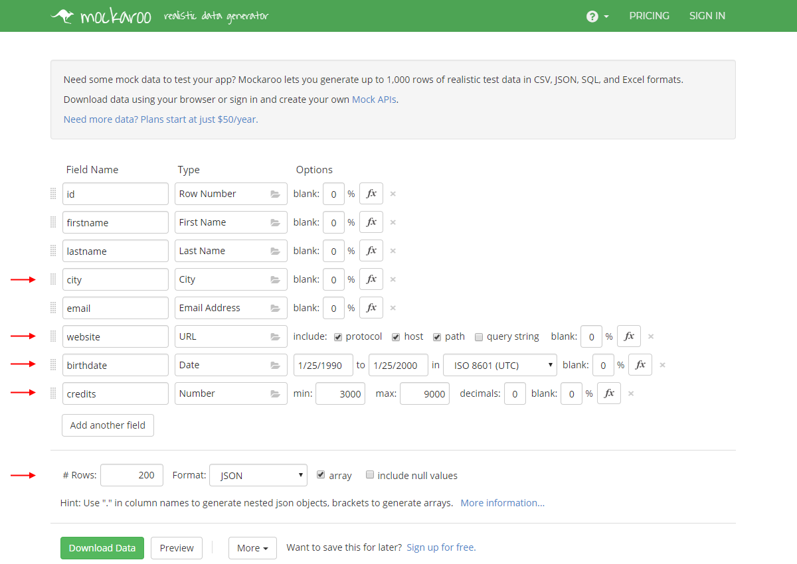
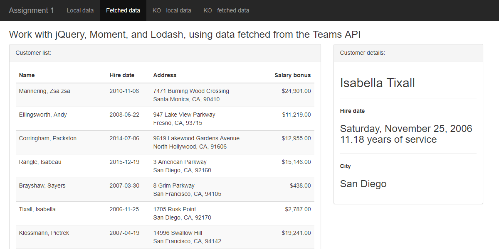

## BTI425 Assignment 1

> This document is being edited.  
> This notice will be removed when the edits are complete.

The purpose or objective of the assignment is to get some experience with widely-used JavaScript libraries, including jQuery, Moment, Lodash, and Knockout. In addition, we will work with the Bootstrap framework. 

Read/skim all of this document before you begin work.

<br>

### Due Date

Sunday, February 4, 2018, at 6:00pm ET

Grade value: 10% of your final course grade

*If you wish to submit the assignment before the due date and time, you can do that.*

<br>

### Introduction to the problem to be solved

We need a simple multi-page web site that will display data. Its pages will have a consistent and neat appearance, and will support a small amount of functionality. 

<br> 

### Specifications overview and work plan

Here's a brief list of specifications that you must implement:

* Follow best practices, guidance, and recommendations
* Includes an index page, and four more pages, each with some functionality

More details are provided below, in the section titled **"Doing the work"**.

During the Thursday class/session, your professor will help you *get started* and *make progress* on the assignment. 

<br>

### Getting started

Open a terminal window. In a suitable file system location, create a folder, probably named "assignment1", to hold your code. 

Create empty source code files for `index.html`, `main.js`, `main.css`. 

Prepare the rest of your dev environment:
* Code editor
* Browser for running your code
* Browser developer tools (at a minimum, you'll probably be using the element inspector, and the JavaScript console)

<br>

### Doing the work

First, you will create an HTML document that can be used as a "page template". 

After it's done, it will be your project's `index.html` entry point page. (Later, after it's done, you will copy-paste it to make other pages.)

<br>

#### Page template

For this first assignment, the instructions below may be more detailed than they need to be, or will be for future assignments. Your professor wants to help you get started with confidence and good coding habits. 

Use Emmet [abbreviations and snippets](https://docs.emmet.io/cheat-sheet/) as much as you can. 

In your code editor, open the empty `index.html` page. Create an HTML5 document with this snippet:

```
html:5
```

Remember, the snippet will include move-cursor edit points (locations). Use the `Tab` and `Shift+Tab` keys to move the cursor to the edit points. Make the initial changes that make sense, especially to the `<title>` element.

While you're there, add a few `<meta>` elements for description, and author (you!).

Later, you will add a `<footer>` element, which will hold your name, and a statement about academic honesty.

<br>

**Libraries from CDN**

Fetch the libraries we need from their [content delivery networks](https://en.wikipedia.org/wiki/Content_delivery_network) (CDN). You will need:
* jQuery
* Bootstrap, CSS and JavaScript
* Moment

The HTML for jQuery and Bootstrap are easy to find. For Moment, use the `cloudflare.com` links. Go to the bottom of the list, and you'll see a couple of links that do NOT have locale info - get one of these for now (e.g. the `.../moment.min.js` link). 

<br>

**Your own code assets**

Before continuing, add in the HTML for the `main.js` that will hold YOUR JavaScript code, and for the `main.css` that will hold your custom CSS. 

<br>

**Page structure, and Bootstrap classes**

If you are not accustomed to the task of creating a "page template", then this may be a bit tedious. Please be patient, as it will return benefits to you. (It's a good idea to start thinking systematically about the task of creating user interfaces.)

There are many different guides and opinions about the "right" way to write your page's HTML code structure. Here, we will offer our suggestions and recommendations. (Other solutions are possible.)

On the `index.html` page, there will be three "areas" of content, from top to bottom:
1. Navigation menu
2. Home page callout or "jumbotron" (but only on `index.html`)
3. Main content

<br>

The purpose of the navigation menu should be obvious. Here's a simple structure that works well for many apps:


<br>

The "jumbotron" provides a large-font introduction to the web site. Remember, it usually appears only on the web site's home or entry page:


<br>

Finally, and most importantly, we have the main content of the page, and all pages. 

Notice the "row" content, which holds divs of a certain width. Different pages will have different needs. 

Notice also the `<footer>` element at the bottom. You must configure it with a statement about academic honesty.



<br>

After putting it all together, you may end up with a result that looks something like this:


<br>

When you're happy with the appearance, you can copy-paste `index.html` to create the other four pages we need:
* Local data
* Fetched data
* Local data, with Knockout
* Fetched data, with Knockout

In the next sections, you will edit those new pages.

<br>

#### Local data

On this page, you will create data in your JavaScript code, and then display it in an HTML Table. And, when a row is clicked, its data will appear in a "details" panel on the right side. 

Here's an example of what you will create:


<br>

**Preparation**

In the previous section, you copied `index.html` to a new "local" page. Remove the jumbotron code from the new page. As appropriate, update `<meta>` elements, and the visible page title. 

The data will appear on the left side area, approximately 8 or 9 grid columns wide. The remaining number of grid columns can be used for the right-side details area. 

The HTML Table must have a value for the `id` attribute, so that you can get to it from your JavaScript code. Create the table structure here. For best results (and code quality), use the `thead` (with `tr` and `th` elements obviously) and `tbody` elements. 

Decide how many data columns you want in the table. The example above has four. Add one more column for the data item's identifier, but use the Bootstrap "hidden" class so that it doesn't clutter up the display. (We usually do this when the identifier doesn't really need to be in the display, yet we still need access to its value from our code.)

> If you want to surround the left and right areas as shown in the example, use the Bootstrap panel classes.

<br>

**Data**

Where do we get the data? Are you expected to hand-type dozens or hundreds of objects in your JavaScript code? No.

Let's use a service named [Mockaroo](https://mockaroo.com/). As stated on its home page:

*"Need some mock data to test your app? Mockaroo lets you generate up to 1,000 rows of realistic test data in CSV, JSON, SQL, and Excel formats."*

The home page defaults will generate 1000 rows of data. We don't need that many rows. Instead, choose 200 to 300. Most of the fields are OK for our purposes, but we must have a date (so that we can use the Moment.js library). We suggest that you replace the last two fields. Configure a date (ISO 8601 format), an integer number, a city, and a URL. The date field will hold a birthdate, so constrain its values to something reasonable for adults. Obviously, we need the data in JSON format. 

Here's what the screen could look like when you're done configuring it, just before downloading the data. Open the image in a new tab/window to view it full-size:



<br>

After downloading, now what?

Open the file and inspect the data. It's an array of objects. Perfect. We will just assign it to a variable.

<br>

**Coding**

Create a variable to hold the data. Its initial value will be an empty array. 

Write a function that loads the data into the array variable. 

Our `main.js` will obviously have a jQuery document-ready function. We suggest that you write its code above the data-loading function. (That simply has the effect of pushing down hundreds of lines of code to the bottom of the source code file, so that your important code is near the top.)

The document-ready function calls the data-loading function. 

Then, it goes through the array, and appends a new table row for each array item. Here:
* Make sure that you include the identifier as a hidden `<td>` element
* Format the birthdate in a nice manner (maybe like you see in the example above)
* Use some common sense when rendering some of the data, and think about its use and purpose (for example, should you display URL text, or render a hyperlink?)

Finally, add a click handler for each row. What will its callback function do? We want it to display the row's data in the right-side area. Notice that the data in the right-side area may be formatted differently than it appears in the table. Just for fun, do a date calculation task, by showing the person's age. The specific formatting doesn't matter much, but make it look nice. (The example above uses a definition list.)

<br>

#### Fetched data

On this page, you will fetch data from your Heroku-hosted Teams API, and then display it in an HTML Table. And, when a row is clicked, its data will appear in a "details" panel on the right side. (Very similar to the task above.)

Here's an example of what you will create:



<br>

**Preparation**

In the previous section, you created a page, grid, and table structure to hold the data. 

Much of that work can be copy-pasted to this "fetched" page. A few of the table columns and identifiers will be different, but it will be similar. Take advantage of that to reduce your work. 

<br>

**Data**

Where do we get the data? 

Let's use your Heroku-hosted Teams API. The "employees" collection has some nice data to display. 

<br>

**Coding**

Optionally, create a variable to hold the data. Its initial value will be an empty array. 

In the document-ready function, add a jQuery `.ajax()` function, to fetch the "employees" data. 

In its `.done()` function, append the nicely-formatted table rows. Here:
* Use the value of the `_id` property as the identifier
* Use some common sense when rendering the data, for example, the address properties
* Format the hire date data in a nice manner
* Format the salary data in a nice manner

The salary data is intended to be dollars. So, let's format it that way. Use the JavaScript `Intl.NumberFormat` object to help with this task. 

Finally, add a click handler for each row. What will its callback function do?

Similar to above, it will display the row's data in the right-side area. It gets the data from *another* Ajax request. (Yes, we know that the data could be fetched from the local array variable. But you should extract the unique identifier `_id` and use it as the parameter in the Ajax request URL. 

Again, just for fun, do a date calculation task, and show a couple of decimal digits. 

<br>

#### Local data, with Knockout

( more to come )

<br>

#### Fetched data, with Knockout

( more to come )

<br>

### Testing your work

For this assignment, there is no external testing capability that can be used. 

Therefore, rely on your browser tools for this step. Soon, your professor will help you learn how to use the debugger.

<br>

### Reminder about academic honesty

You must comply with the College’s academic honesty policy.

Although you may interact and collaborate with others, you must submit your own work.

<br> 

### Submitting your work

Here’s how to submit your work, before the due date and time:

1. Locate the folder that holds your project files. 

2. Make a copy of the folder. (You will be uploading a zipped version of the copy.)

3. Compress/zip the copied folder. The zip file SHOULD be less than 1MB in size. If it isn’t, you haven’t followed the instructions properly.

4. Login to My.Seneca. Open the course area. Click the “Assignments” link on the left-side navigator. Follow the link for this assignment. Submit/upload your zip file. The page will accept three submissions, so if you upload, then decide to fix something and upload again, you can do so.

<br>
