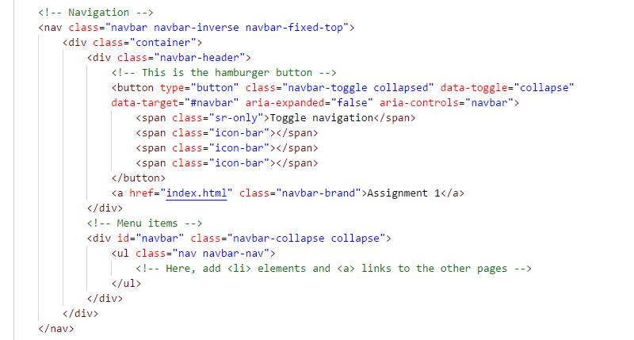
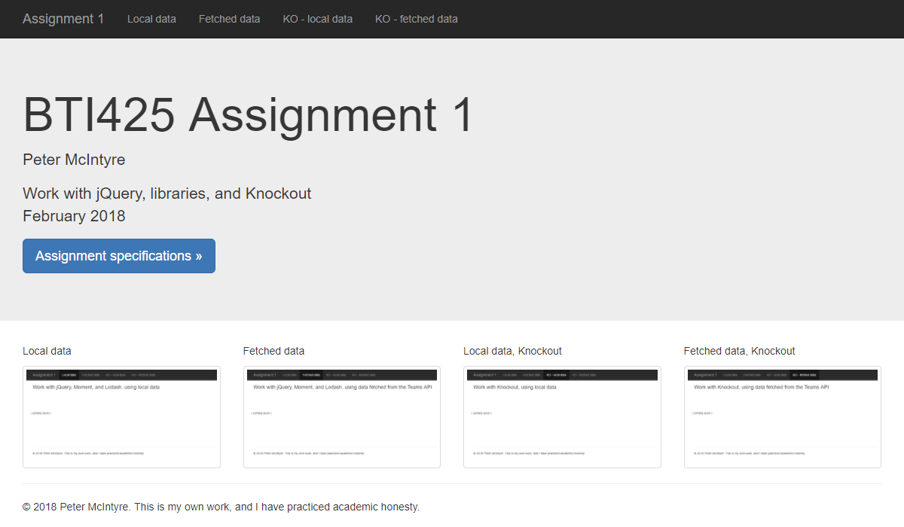
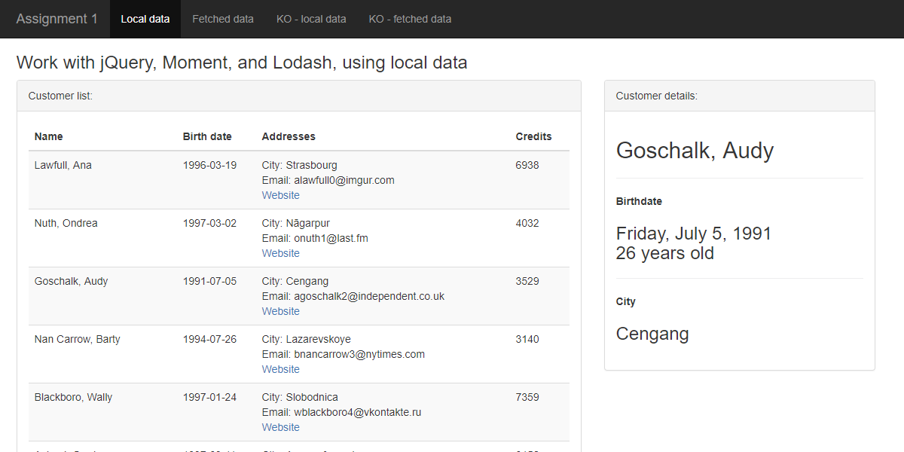

## BTI425 Assignment 1

> This document is being edited.  
> This notice will be removed when the edits are complete.

The purpose or objective of the assignment is to get some experience with widely-used JavaScript libraries, including jQuery, Moment, Lodash, and Knockout. In addition, we will work with the Bootstrap framework. 

Read/skim all of this document before you begin work.

<br>

### Due Date

Sunday, February 4, 2018, at 6:00pm ET

Grade value: 10% of your final course grade

*If you wish to submit the assignment before the due date and time, you can do that.*

<br>

### Introduction to the problem to be solved

We need a simple multi-page web site that will display data. Its pages will have a consistent and neat appearance, and will support a small amount of functionality. 

<br> 

### Specifications overview and work plan

Here's a brief list of specifications that you must implement:

* Follow best practices, guidance, and recommendations
* Includes an index page, and four more pages, each with some functionality

More details are provided below, in the section titled **"Doing the work"**.

During the Thursday class/session, your professor will help you *get started* and *make progress* on the assignment. 

<br>

### Getting started

Open a terminal window. In a suitable file system location, create a folder, probably named "assignment1", to hold your code. 

Create empty source code files for `index.html`, `main.js`, `main.css`. 

Prepare the rest of your dev environment:
* Code editor
* Browser for running your code
* Browser developer tools (at a minimum, you'll probably be using the element inspector, and the JavaScript console)

<br>

### Doing the work

First, you will create an HTML document that can be used as a "page template". 

After it's done, it will be your project's `index.html` entry point page. (Later, after it's done, you will copy-paste it to make other pages.)

<br>

#### Page template

For this first assignment, the instructions below may be more detailed than they need to be, or will be for future assignments. Your professor wants to help you get started with confidence and good coding habits. 

Use [Emmet](https://emmet.io/) abbreviations and snippets as much as you can. 

In your code editor, open the empty `index.html` page. Create an HTML5 document with this snippet:

```
html:5
```

Remember, the snippet will include move-cursor edit points/locations. Use the `Tab` and `Shift+Tab` keys to move the cursor to the edit locations. Make the initial changes that make sense, especially to the `<title>` element.

While you're there, add a few `<meta>` elements for description, and author (you!).

Later, you will add a `<footer>` element, which will hold your name, and a statement about academic honesty.

<br>

**Libraries from CDN**

Fetch the libraries we need from their [content delivery networks](https://en.wikipedia.org/wiki/Content_delivery_network) (CDN). You will need:
* jQuery
* Bootstrap, CSS and JavaScript
* Moment

The HTML for jQuery and Bootstrap are easy to find. For Moment, use the `cloudflare.com` links. Go to the bottom of the list, and you'll see a couple of links that do NOT have locale info - get one of these for now (e.g. the `.../moment.min.js` link). 

<br>

**Your own code assets**

Before continuing, add in the HTML for the `main.js` that will hold YOUR JavaScript code, and for the `main.css` that will hold your custom CSS. 

<br>

**Page structure, and Bootstrap classes**

If you are not accustomed to the task of creating a "page template", then this may be a bit tedious. Please be patient, as it will return benefits to you. (It's a good idea to start thinking systematically about the task of creating user interfaces.)

There are many different guides and opinions about the "right" way to write your page's HTML code structure. Here, we will offer our suggestions and recommendations. (Other solutions are possible.)

On the `index.html` page, there will be three "areas" of content, from top to bottom:
1. Navigation menu
2. Home page callout or "jumbotron" (but only on `index.html`)
3. Main content

<br>

The purpose of the navigation menu should be obvious. Here's a simple structure that works well for many apps:



<br>

The "jumbotron" provides a large-font introduction to the web site. Remember, it usually appears only on the web site's home or entry page:


<br>

Finally, and most importantly, we have the main content of the page, and all pages. 

Notice the "row" content, which holds divs of a certain width. Different pages will have different needs. 

Notice also the `<footer>` element at the bottom. You must configure it with a statement about academic honesty.


<br>

After putting it all together, you may end up with a result that looks something like this:



<br>

When you're happy with the appearance, you can copy-paste `index.html` to create the other four pages we need:
* Local data
* Fetched data
* Local data, with Knockout
* Fetched data, with Knockout

In the next sections, you will edit those new pages.

<br>

#### Local data

( more to come )

( here's a preview... )



<br>

#### Fetched data

( more to come )

<br>

#### Local data, with Knockout

( more to come )

<br>

#### Fetched data, with Knockout

( more to come )

<br>

### Testing your work

( more to come )

<br>

### Reminder about academic honesty

You must comply with the College’s academic honesty policy.

Although you may interact and collaborate with others, you must submit your own work.

<br> 

### Submitting your work

Here’s how to submit your work, before the due date and time:

1. Locate the folder that holds your project files. 

2. Make a copy of the folder. (You will be uploading a zipped version of the copy.)

3. Compress/zip the copied folder. The zip file SHOULD be less than 1MB in size. If it isn’t, you haven’t followed the instructions properly.

4. Login to My.Seneca. Open the course area. Click the “Assignments” link on the left-side navigator. Follow the link for this assignment. Submit/upload your zip file. The page will accept three submissions, so if you upload, then decide to fix something and upload again, you can do so.

<br>
