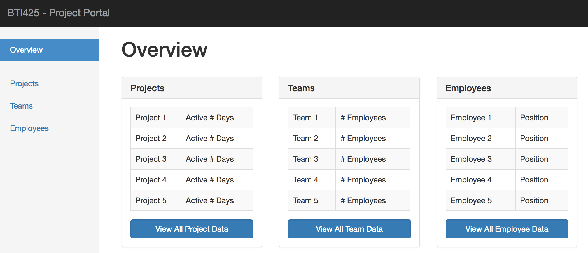

## BTI425 Assignment 2

> This document is being edited.  
> This notice will be removed when the edits are complete.

The purpose or objective of the assignment is to get some experience with React. 

Read/skim all of this document before you begin work.

<br>

### Due Date

Sunday, February 18, 2018, at 6:00pm ET

Grade value: 10% of your final course grade

*If you wish to submit the assignment before the due date and time, you can do that.*

<br>

### Introduction to the problem to be solved

We need a React app that will display data from the Teams API. The app will have multiple components, and support routing. When finished, the initial or landing-page view of the app will look similar to the following:


<br> 

### Specifications overview and work plan

Here's a brief list of specifications that you must implement:

* Follow best practices, guidance, and recommendations
* Continues to work with your Teams API, using an HTTP request add-in named "axios" 
* Has four component views, Overview, Projects, Teams, and Employees 
* Viewing a component is implemented by routing
* Display-only, we will not be updating or modifying the data

More details are provided below, in the section titled **"Doing the work"**.

During the Thursday classes/sessions, your professor will help you *get started* and *make progress* on the assignment. 

<br>

### Getting started

Open a terminal window, and navigate to a suitable file system location. We will use the `create-react-app` program to create the folder and its generated code:

```
create-react-app assignment2
```

After it completes, verify that it runs, by using the `npm start` command; it should show the "Welcome to React" view. You can close it, and shut down (Control+C) the process in your terminal window. 

Prepare the rest of your dev environment:
* Code editor
* Browser developer tools (at a minimum, you'll probably be using the element inspector, and the JavaScript console)

<br>

#### Add links to Bootstrap CSS and plugins

Edit `public/index.html`:
1. Add the Bootstrap CSS library link element (CDN version) to the `<head>` element
2. Add the jQuery and Bootstrap JavaScript script elements to the end of the `<body>` element

<br>

#### Add new packages

This app will send requests to your Teams API. React has no built-in way to compose HTTP requests. The React designers leave that to us as programmers. We could use the native `XmlHttpRequest` object, the newer `fetch` API, or any of several libraries. For this assignment, let's use a well-known library named [axios](https://github.com/axios/axios). Using a terminal window (and located in the `assignment2` folder), add axios:

```
npm install --save axios
```

Some of the data in the Teams API is date-and-time oriented. Let's continue to use the [Moment.js](https://momentjs.com) library. In Assignment 1, we referred to it using a content delivery network (CDN). In this assignment, let's add the code:

```
npm install --save moment
```

Finally, we will be creating multiple components, and replacing a large area/rectangle on the view with content from the different components. This will be done with resource URLs, and a feature called routing. The base React library does not include routing; the React designers leave that to us as programmers. We will use the well-known [React Router](https://reacttraining.com/react-router/) library. Add the code:

```
npm install --save react-router-dom
```

<br>

#### Get some "starter" source code files

To help you get started with the appearance of the "Overview" view, we have created some "starter" source code files. On the GitHub code repository, in the `Templates_and_solutions` folder, locate the `a2-source` folder. Inside, there are two source code files. 

The contents of `App.js` will *replace* the generated code in App.cs. 

Similarly, the contents of `index.css` will *replace* the generated code in index.css. 

After you save your work and restart the app (in your terminal window), the initial view will look similar to the following:



<br>

### Doing the work

( more to come )

<br>

#### (TBA specific tasks)

TBA

<br>

**(subsections)**

TBA

<br>

### Testing your work

For this assignment, there is no external testing capability that can be used. 

Therefore, rely on your browser tools for this step. Soon, your professor will help you learn how to use the debugger.

<br>

### Reminder about academic honesty

You must comply with the College’s academic honesty policy.

Although you may interact and collaborate with others, you must submit your own work.

<br> 

### Submitting your work

Here’s how to submit your work, before the due date and time:

1. Locate the folder that holds your project files. 

2. Make a copy of the folder. (You will be uploading a zipped version of the copy.)

3. Inside that folder, remove (delete) the `node_modules` folder. Your professor does NOT need that folder. 

4. Compress/zip the copied folder. The zip file SHOULD be less than 1MB in size. If it isn’t, you haven’t followed the instructions properly.

5. Login to My.Seneca. Open the course area. Click the “Assignments” link on the left-side navigator. Follow the link for this assignment. Submit/upload your zip file. The page will accept three submissions, so if you upload, then decide to fix something and upload again, you can do so.

<br>
