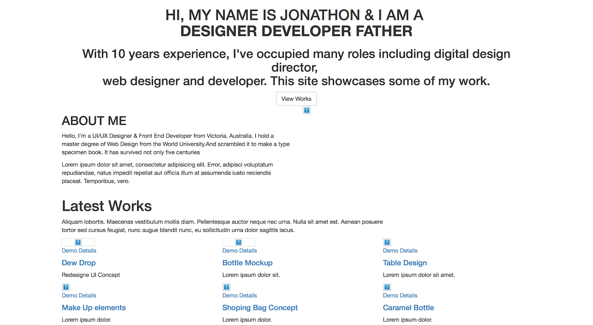
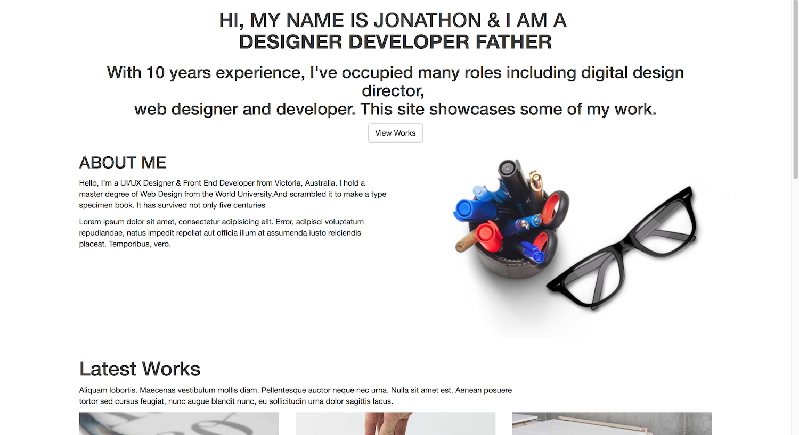
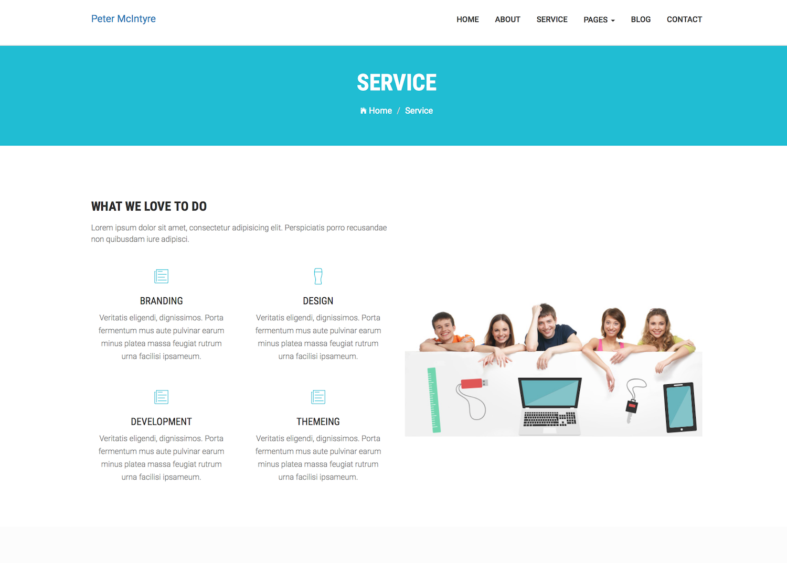
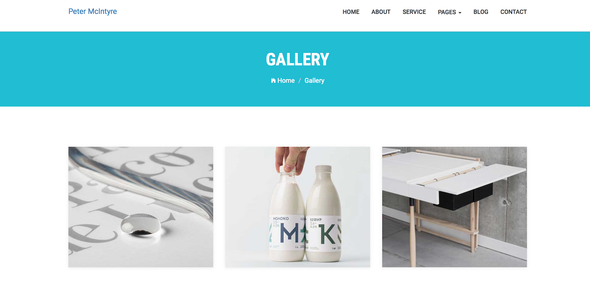

## BTI425 Assignment 3

The purpose or objective of the assignment is to become comfortable with Angular components. 

Read/skim all of this document before you begin work.

> This page is being edited.  
> The specifications for project #1 are complete.  
> I plan to add the remaining specifications by Monday, February 26.  
> This notice will be removed when the edits are complete.  

<br>

### Due Date

Sunday, March 11, 2018, at 6:00pm ET

Grade value: 10% of your final course grade

*If you wish to submit the assignment before the due date and time, you can do that.*

<br>

### Introduction to the problem to be solved

In this assignment, you will work on *two* projects:
1. Converting, or refactoring, a web site template, into an Angular app
2. Working with local (in-memory) data and Angular components

The projects are separate and independent. They have nothing to do with each other. 

Here's an image that shows the top part of the view in project #1. As with any image on this web site, you can open the image in a new tab/window to view it full-size:


<br>

Here's an image that shows the top part of the view in project #2:


<br>

**New with this assignment - important**

The first two assignments in this course included detailed how-to instructions. For this assignment, and future assignments, the instructions will be less detailed, with less guidance 

As a result, you will have to apply recently-learned knowledge, acquire new knowledge (that's within the topic scope), and make some decisions on your own at times. 

Some "how-to" instructions will come from the course notes and the official (supported and recommended) documentation. You should not (or must not) have to perform general web searches for answers, unless you're just using a web search to look for content on the course web site and the official documents collection. 

Spend the time learning the foundations. Don't spend the time looking for unapproved code snippets. That never ends well. Ask questions when you need to - your professor can help. 

Make sure you have and use a *coding plan*. You are probably not yet skilled enough with Angular apps to be able to go immediately from an abstract thought to working code. Use a coding plan as an intermediate step - get your thoughts written down, refine, iterate, and then write some code. 

<br> 

### Specifications overview and work plan

Here's a brief list of specifications that you must implement in project #1:

* Convert (or refactor) a multi-page HTML web site into an Angular app
* Each component will render one of the original HTML pages
* The app will attempt to retain much of the original styling cues or hints 

When you're thinking about the purpose of this project #1, you could think of it as a way to build a personal professional portfolio, which you could use to feature your experience in this BSD program. 

Also, when you're planning the time to work on this assignment, you should expect that project #1 will be easier than project #2. Maybe you can plan to spend about one-third of your time on project #1. For example, if your time budget for this assignment is 10 hours, then budget about 3 hours for project #1.

Here's a brief *and tentative* list of specifications that you must implement in project #2:

* Components, many
* Local in-memory data, display and edit 
* Master > detail paradigm, and data flow among components
* Nested components would be nice to attempt
* Some introductory coverage of routing 

When you're thinking about the purpose of this project #2, you could think of it as a way to become skilled in the most essential Angular development task, which is working with components in general, and data in components specifically. 

For both projects, make sure that you follow best practices, guidance, and recommendations. 

More details are provided below, in the section titled **"Doing the work"**.

During the Thursday classes/sessions, your professor will help you *get started* and *make progress* on the assignment. 

<br>

### Getting started

Before you work on the assignment, you should have attempted to construct the apps that are described in the [Angular Components Example](../notes/angular-components-example), and in the [Angular Components In-Class Demonstration](../notes/angular-components-inclass). 

This assignment work must not be the first time that you have attempted to work with components. Constructing these examples will be beneficial and worth your time.

<br>

**Starting work on the assignment**

Open a terminal window, and navigate to a suitable file system location. We will use the Angular CLI program to create the folder and its generated code for *both* projects:

```
ng new a3-project1 --routing -st -sg
```

And:

```
ng new a3-project2 --routing -st -sg
```

After the generation completes, verify that it runs, by separately navigating into each folder, and using the `ng serve --open` command in the newly-created folder. Each should build/compile, open a browser window/tab, and show the "welcome" view. 

Prepare the rest of your dev environment:
* Select the project that you want to work on, and then use a terminal window to build/compile and run it 
* Probably use another terminal window (so you can run code-generation commands)
* Probably use one or two Finder windows/tabs (for graphical navigation and Quick Look viewing)
* Code editor (for project #1, you will be probably use another editor instance to work with downloaded source code files)
* Browser developer tools (at a minimum, you'll probably be using the element inspector, and the JavaScript console)

<br>

### Doing the work, project #1 (web site convert)

On the web, there are people and companies that offer *web site templates*. These are packages of code that enable a developer to create a decent-looking web site with a reasonably small amount of effort. Some are free, and others cost money. 

A typical web site template package of code includes some HTML pages, some CSS rules, often some JavaScript, as well as other assets (e.g. images and so on). The idea is that the package can be edited, placed on a public web server, and made available to users on the public web.

Your professor has identified a template that must be used for this assignment. A web site named Themefisher has a personal portfolio web site template named "Timer", which will be suitable. Among other features, it uses Bootstrap 3, so you will be able to continue working with that library. 

Download the web site template package, which comes as a zip file. [Visit the info page](https://themefisher.com/products/timer-responsive-multipage-agency-template/), and check it out (view the "live preview" too). Then, follow the path that enables you to download the free version. The process will send you an email message, and the email includes a confirm-and-download link. After it gets to your computer, unzip it, and be ready to work with its files.

<br>

#### The app's `index.html` file

A new habit that you should have is to add the link to the Bootstrap CDN source. You learned to do that with your React apps, and the idea is the same with Angular apps. 

<br>

#### Front page

As you have learned, the App component's HTML template holds the markup that is displayed first when the app loads. 

Locate the markup in the downloaded index.html file that is appropriate for the App component. (Think, and be critical - do you need the markup at the top that builds the nav menu? No, because we'll be creating a Navbar component in our app. Do you need the markup at the bottom that links to the JavaScript files? No, because we'll be using Angular as much as we can.)

> Do you understand? The app does NOT need any external or additional JavaScript.  
> The main goal of this project #1 is simple - convert or refactor a page-based web site into an app. Do not waste time (or get lost) on implementing arcane features of the downloaded content. 

Replace the App component's markup with the downloaded markup. Save and view the results. If you see an empty page, then it is likely that there is a build/compile error, so check the console. 

At this point, your work may look something like this. 



<br>

#### Images

Notice that the images in the copied markup are not rendering. The path is wrong. (Why? Look at the markup, and the file system, and think about it.)

An Angular app has a folder named "assets" in the "src" folder. That's where we can put image assets. Therefore, copy the downloaded "images" folder to the "assets" folder. 

The path value of each `` element's `src` attribute will be wrong too. From the perspective of the markup in Angular components, the "src" folder is the root. Therefore, each path must be prefixed with the "assets" folder name. For example:  

```
assets/images/about/about.jpg
```

<br>

> Tip:  
> Learn how to use one or more bulk replace features of the editor.  
> There are at least two such features:  
> 1 - Edit > Replace in Files, or  
> 2 - Select the text to be replaced, then right-click > Change All Occurrences  
> Each has its own considerations, so be sure to save before you do it, so that you can undo if things go wrong .

<br>

It's possible that the images won't show up right away. If not, switch to the Terminal, and reload the app. Or, make a change in one of the source code files (e.g. the App component's HTML template) and save again (which triggers the build/compile step).

At this point, your work may look something like this. 



<br>

#### Other components, getting started

The Themefisher Timer web site template obviously has a navigation bar (header), and a footer. Create components for these areas. Then locate the downloaded markup that you can cut and paste into the new components. 

> Note:  
> On Thursday, February 22, we noticed that the computers in DB3078 may return the following error message when the Angular CLI "generate" program is used:  
> `Cannot read property 'NullLogger' of undefined`  
> If you get that error message, then there may be a work-around. Use the following command to (temporarily?) update the Angular CLI version:  
> `npm install --save @angular/cli@latest`  

<br>

For now, don't worry that the hyperlink targets are wrong.

> Remember to add an academic honesty statement to the footer markup, replacing existing text as appropriate. Something like this:  
> Copyright &copy; 2018 - Design and Developed by Peter McIntyre.  
> This is my own work, and I have practiced academic honesty.

<br>

#### Content components

The other downloaded HTML files have additional content that we can display. Create components for these content areas. Select only one of the "blog..." pages to convert into a "Blog" component. Remember what you read and learned - when you create (generate) a component for a multi-word thing (that's joined by spaces or dashes), use a [Pascal case](https://en.wikipedia.org/wiki/Camel_case) name (e.g. "single-post.html" becomes a "SinglePost" component). 

What about the content that's now in the App component (which was copied from the downloaded index.html)? Well, a suggested best practice is to create another component to hold that - maybe call it "Home". Then, cut-and-paste the markup from the App component to the new Home component.

<br>

**Arranging the components**

The task above leaves the App component empty. Fix that now, by adding the custom elements for the several components that you added above. 

On refresh, you should have a *very* long view. 

<br>

#### Navigation, simple

We're going to use [on-page links](https://developer.mozilla.org/en-US/docs/Web/HTML/Element/a#attr-href) in the navigation bar component. 

If you inspect the existing content from the downloaded index.html page, you will notice that it already has on-page links for the following targets: top-bar, hero-area, about, works, feature, call-to-action, and footer. Therefore, you cannot use those as identifiers in the components. Either edit the pasted content from the downloaded index.html, or use different names for the identifiers. 

Make those changes now. Obviously, you will have to edit the links in the navigation bar component, and add or edit anchors in each targeted component. 

Above, it was suggested that only one of the "blog" components is needed. When you do this, you must edit the "blog" nav menu choices to match what you did. 

In the downloaded content, the upper-left icon/image of the nav menu is a link to the home page (index.html). The icon/image is useless to us. You can replace that with your name as text. (And, as just described, change the link target to a component.)

<br>

#### General suggestions for all pasted content

The *link targets* and *resource URLs* must be edited after content is pasted into the new components. 

The *link targets* in the downloaded content point to actual `.html` files. They must be converted to on-page links to the component content. We must NOT reload the app. 

The *resource URLs* for images and a few other resources point to locations that make sense for a page-based web site. They are not valid for an app. As noted above, a path that begins with something like `images/...` must be changed to something like `assets/images/...`. 

> Remember:  
> The "root" of the URL space in an Angular app is the `src` folder. 

<br>

**Watch for errors in the downloaded content**

As noted above, the downloaded content has a few errors in the markup, and you must fix them before the app works. Use the dev tools console to locate and fix the errors as you find them. 

<br>

**Appearance enhancements**

There are a number of resources in the "plugins" folder of the downloaded content. They provide some appearance or user interaction enhancements. (It is worthwhile to briefly inspect some of them.) We suggest that you copy-paste the plugins folder into the app's "assets" folder, and then include links to them in the app's `index.html` file, in the `<head>` element. Make sure you edit the resource URL paths. 

<br>

**Footer content**

We recommend that you page the "call to action" content in the footer component. 

<br>

**When you're done...**

At this point, your work may look something like the following:

Initial view, and the target of the "home" links:


<br>

About view:


<br>

Service view:



<br>

Blog view:


<br>

Contact view:


<br>

Not found view:


<br>
Gallery view:



<br>

Footer, at the bottom of the "contact" view:


<br>

### Doing the work, project #2 (components)

As noted above, this project #2 enables you to work with local (in-memory) data and Angular components. It also enables you to begin working with *routing, services, and forms* in a very light-touch and guided manner. (Complete coverage of those topics happens in the coming weeks. )

The idea is this: 
* You will work with your Mockaroo.com generated data
* Components that implement [CRUD](https://en.wikipedia.org/wiki/Create,_read,_update_and_delete) will be configured 
* As a result, you'll get experience with components and a workflow, and get a preview of some upcoming Angular features

Above, you had created an app for project #2 (a3-project2). Get your development environment ready to work with it now. 

<br>

#### Add links to Bootstrap CSS and plugins

Edit `src/index.html`:
1. Add the Bootstrap CSS library link element (probably the CDN version) to the `<head>` element
2. Add the jQuery and Bootstrap JavaScript script elements to the *end* of the `<body>` element

( name, displayed and metadata; academic honesty statement )

( more to come )

<br>

#### TBA

( more to come )

<br>

### Testing your work

For this assignment, there is no external testing capability that can be used. 

Therefore, rely on your browser tools for this step. Soon, your professor will help you learn how to use the debugger.

<br>

### Reminder about academic honesty

You must comply with the College’s academic honesty policy.

Although you may interact and collaborate with others, you must submit your own work.

<br> 

### Submitting your work

Here’s how to submit your work, before the due date and time:

1. Locate the folder that holds your project files. 

2. Make a copy of the folder. (You will be uploading a zipped version of the copy.)

3. Inside that folder, remove (delete) the `node_modules` folder. Your professor does NOT need that folder. 

4. Compress/zip the copied folder. The zip file SHOULD be less than 1MB in size. If it isn’t, you haven’t followed the instructions properly.

5. Login to My.Seneca. Open the course area. Click the “Assignments” link on the left-side navigator. Follow the link for this assignment. Submit/upload your zip file. The page will accept three submissions, so if you upload, then decide to fix something and upload again, you can do so.

<br>
