## BTI425 Assignment 3

The purpose or objective of the assignment is to become comfortable with Angular components. 

Read/skim all of this document before you begin work.

<br>

Quick on-page links:

Beginning of the "project 1 specifications" section - [project 1](https://sictweb.github.io/bti425/graded-work/assign3#doing-the-work-project-1-web-site-convert)

Beginning of the "project 2 specifications" section - [project 2](https://sictweb.github.io/bti425/graded-work/assign3#doing-the-work-project-2-components)

<br>

### Due Date

Sunday, March 11, 2018, at 6:00pm ET

Grade value: 10% of your final course grade

*If you wish to submit the assignment before the due date and time, you can do that.*

<br>

### Introduction to the problem to be solved

In this assignment, you will work on *two* projects:
1. Converting, or refactoring, a web site template, into an Angular app
2. Working with local (in-memory) data and Angular components

The projects are separate and independent. They have nothing to do with each other. 

Here's an image that shows the top part of the view in project #1. As with any image on this web site, you can open the image in a new tab/window to view it full-size:


<br>

Here's an image that shows the top part of the view in project #2:


<br>

**New with this assignment - important**

The first two assignments in this course included detailed how-to instructions. For this assignment, and future assignments, the instructions will be less detailed, with less guidance 

As a result, you will have to apply recently-learned knowledge, acquire new knowledge (that's within the topic scope), and make some decisions on your own at times. 

Some "how-to" instructions will come from the course notes and the official (supported and recommended) documentation. You should not (or must not) have to perform general web searches for answers, unless you're just using a web search to look for content on the course web site and the official documents collection. 

Spend the time learning the foundations. Don't spend the time looking for unapproved code snippets. That never ends well. Ask questions when you need to - your professor can help. 

Make sure you have and use a *coding plan*. You are probably not yet skilled enough with Angular apps to be able to go immediately from an abstract thought to working code. Use a coding plan as an intermediate step - get your thoughts written down, refine, iterate, and then write some code. 

<br> 

### Specifications overview and work plan

Here's a brief list of specifications that you must implement in project #1:

* Convert (or refactor) a multi-page HTML web site into an Angular app
* Each component will render one of the original HTML pages
* The app will attempt to retain much of the original styling cues or hints 

When you're thinking about the purpose of this project #1, you could think of it as a way to build a personal professional portfolio, which you could use to feature your experience in this BSD program. 

Also, when you're planning the time to work on this assignment, you should expect that project #1 will be easier than project #2. Maybe you can plan to spend about one-third of your time on project #1. For example, if your time budget for this assignment is 10 hours, then budget about 3 hours for project #1.

Here's a brief *and tentative* list of specifications that you must implement in project #2:

* Components, many
* Local in-memory data, display and edit 
* Master > detail paradigm, and data flow among components
* Some introductory coverage of routing, services, and forms

When you're thinking about the purpose of this project #2, you could think of it as a way to become skilled in the most essential Angular development task, which is working with components in general, and data in components specifically. 

For both projects, make sure that you follow best practices, guidance, and recommendations. 

More details are provided below, in the section titled **"Doing the work"**.

During the Thursday classes/sessions, your professor will help you *get started* and *make progress* on the assignment. 

<br>

### Getting started

Before you work on the assignment, you should have attempted to construct the apps that are described in the [Angular Components Example](../notes/angular-components-example), and in the [Angular Components In-Class Demonstration](../notes/angular-components-inclass). 

This assignment work must not be the first time that you have attempted to work with components. Constructing these examples will be beneficial and worth your time.

<br>

**Starting work on the assignment**

Open a terminal window, and navigate to a suitable file system location. We will use the Angular CLI program to create the folder and its generated code for *both* projects:

```
ng new a3-project1 --routing -st -sg
```

And:

```
ng new a3-project2 --routing -st -sg
```

After the generation completes, verify that it runs, by separately navigating into each folder, and using the `ng serve --open` command in the newly-created folder. Each should build/compile, open a browser window/tab, and show the "welcome" view. 

Prepare the rest of your dev environment:
* Select the project that you want to work on, and then use a terminal window to build/compile and run it 
* Probably use another terminal window (so you can run code-generation commands)
* Probably use one or two Finder windows/tabs (for graphical navigation and Quick Look viewing)
* Code editor (for project #1, you will be probably use another editor instance to work with downloaded source code files)
* Browser developer tools (at a minimum, you'll probably be using the element inspector, and the JavaScript console)

<br>

### Doing the work, project #1 (web site convert)

On the web, there are people and companies that offer *web site templates*. These are packages of code that enable a developer to create a decent-looking web site with a reasonably small amount of effort. Some are free, and others cost money. 

A typical web site template package of code includes some HTML pages, some CSS rules, often some JavaScript, as well as other assets (e.g. images and so on). The idea is that the package can be edited, placed on a public web server, and made available to users on the public web.

Your professor has identified a template that must be used for this assignment. A web site named Themefisher has a personal portfolio web site template named "Timer", which will be suitable. Among other features, it uses Bootstrap 3, so you will be able to continue working with that library. 

Download the web site template package, which comes as a zip file. [Visit the info page](https://themefisher.com/products/timer-responsive-multipage-agency-template/), and check it out (view the "live preview" too). Then, follow the path that enables you to download the free version. The process will send you an email message, and the email includes a confirm-and-download link. After it gets to your computer, unzip it, and be ready to work with its files.

<br>

#### The app's `index.html` file

A new habit that you should have is to add the link to the Bootstrap CDN source. You learned to do that with your React apps, and the idea is the same with Angular apps. 

<br>

#### Front page

As you have learned, the App component's HTML template holds the markup that is displayed first when the app loads. 

Locate the markup in the downloaded index.html file that is appropriate for the App component. (Think, and be critical - do you need the markup at the top that builds the nav menu? No, because we'll be creating a Navbar component in our app. Do you need the markup at the bottom that links to the JavaScript files? No, because we'll be using Angular as much as we can.)

> Do you understand? The app does NOT need any external or additional JavaScript.  
> The main goal of this project #1 is simple - convert or refactor a page-based web site into an app. Do not waste time (or get lost) on implementing arcane features of the downloaded content. 

Replace the App component's markup with the downloaded markup. Save and view the results. If you see an empty page, then it is likely that there is a build/compile error, so check the console. 

At this point, your work may look something like this. 


<br>

#### Images

Notice that the images in the copied markup are not rendering. The path is wrong. (Why? Look at the markup, and the file system, and think about it.)

An Angular app has a folder named "assets" in the "src" folder. That's where we can put image assets. Therefore, copy the downloaded "images" folder to the "assets" folder. 

The path value of each `` element's `src` attribute will be wrong too. From the perspective of the markup in Angular components, the "src" folder is the root. Therefore, each path must be prefixed with the "assets" folder name. For example:  

```
assets/images/about/about.jpg
```

<br>

> Tip:  
> Learn how to use one or more bulk replace features of the editor.  
> There are at least two such features:  
> 1 - Edit > Replace in Files, or  
> 2 - Select the text to be replaced, then right-click > Change All Occurrences  
> Each has its own considerations, so be sure to save before you do it, so that you can undo if things go wrong .

<br>

It's possible that the images won't show up right away. If not, switch to the Terminal, and reload the app. Or, make a change in one of the source code files (e.g. the App component's HTML template) and save again (which triggers the build/compile step).

At this point, your work may look something like this. 


<br>

#### Other components, getting started

The Themefisher Timer web site template obviously has a navigation bar (header), and a footer. Create components for these areas. Then locate the downloaded markup that you can cut and paste into the new components. 

> Note:  
> On Thursday, February 22, we noticed that the computers in DB3078 may return the following error message when the Angular CLI "generate" program is used:  
> `Cannot read property 'NullLogger' of undefined`  
> If you get that error message, then there may be a work-around. Use the following command to (temporarily?) update the Angular CLI version:  
> `npm install --save @angular/cli@latest`  

<br>

For now, don't worry that the hyperlink targets are wrong.

> Remember to add an academic honesty statement to the footer markup, replacing existing text as appropriate. Something like this:  
> Copyright &copy; 2018 - Design and Developed by Peter McIntyre.  
> This is my own work, and I have practiced academic honesty.

<br>

#### Content components

The other downloaded HTML files have additional content that we can display. Create components for these content areas. Select only one of the "blog..." pages to convert into a "Blog" component. Remember what you read and learned - when you create (generate) a component for a multi-word thing (that's joined by spaces or dashes), use a [Pascal case](https://en.wikipedia.org/wiki/Camel_case) name (e.g. "single-post.html" becomes a "SinglePost" component). 

What about the content that's now in the App component (which was copied from the downloaded index.html)? Well, a suggested best practice is to create another component to hold that - maybe call it "Home". Then, cut-and-paste the markup from the App component to the new Home component.

<br>

**Arranging the components**

The task above leaves the App component empty. Fix that now, by adding the custom elements for the several components that you added above. 

On refresh, you should have a *very* long view. 

<br>

#### Navigation, simple

We're going to use [on-page links](https://developer.mozilla.org/en-US/docs/Web/HTML/Element/a#attr-href) in the navigation bar component. 

If you inspect the existing content from the downloaded index.html page, you will notice that it already has on-page links for the following targets: top-bar, hero-area, about, works, feature, call-to-action, and footer. Therefore, you cannot use those as identifiers in the components. Either edit the pasted content from the downloaded index.html, or use different names for the identifiers. 

Make those changes now. Obviously, you will have to edit the links in the navigation bar component, and add or edit anchors in each targeted component. 

Above, it was suggested that only one of the "blog" components is needed. When you do this, you must edit the "blog" nav menu choices to match what you did. 

In the downloaded content, the upper-left icon/image of the nav menu is a link to the home page (index.html). The icon/image is useless to us. You can replace that with your name as text. (And, as just described, change the link target to a component.)

<br>

#### General suggestions for all pasted content

The *link targets* and *resource URLs* must be edited after content is pasted into the new components. 

The *link targets* in the downloaded content point to actual `.html` files. They must be converted to on-page links to the component content. We must NOT reload the app. 

The *resource URLs* for images and a few other resources point to locations that make sense for a page-based web site. They are not valid for an app. As noted above, a path that begins with something like `images/...` must be changed to something like `assets/images/...`. 

> Remember:  
> The "root" of the URL space in an Angular app is the `src` folder. 

<br>

**Watch for errors in the downloaded content**

As noted above, the downloaded content has a few errors in the markup, and you must fix them before the app works. Use the dev tools console to locate and fix the errors as you find them. 

<br>

**Appearance enhancements**

There are a number of resources in the "plugins" folder of the downloaded content. They provide some appearance or user interaction enhancements. (It is worthwhile to briefly inspect some of them.) We suggest that you copy-paste the plugins folder into the app's "assets" folder, and then include links to them in the app's `index.html` file, in the `<head>` element. Make sure you edit the resource URL paths. 

<br>

**Footer content**

We recommend that you page the "call to action" content in the footer component. 

<br>

**When you're done...**

At this point, your work may look something like the following:

Initial view, and the target of the "home" links:


<br>

About view:


<br>

Service view:


<br>

Blog view:

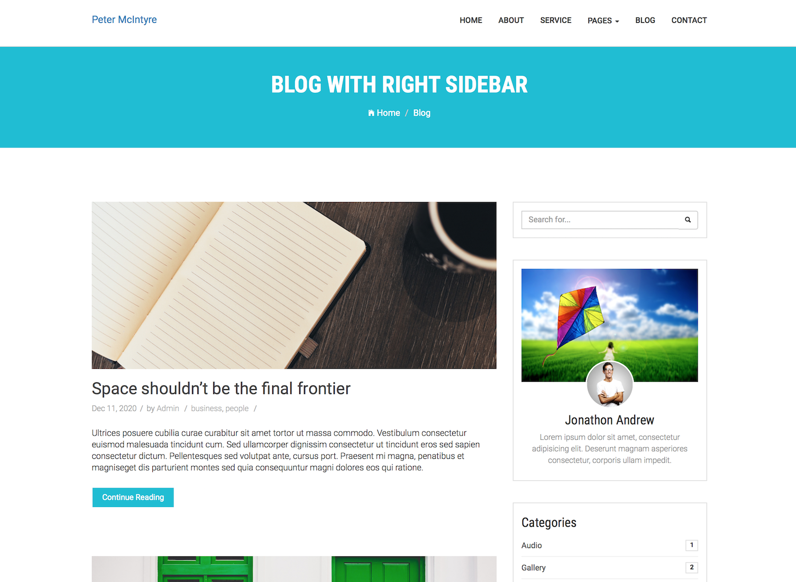

<br>

Contact view:

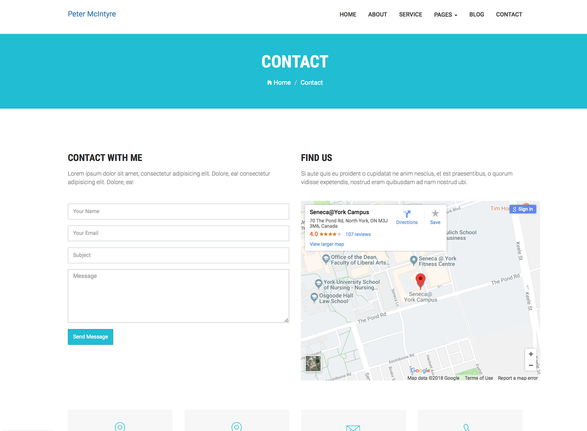

<br>

Not found view:

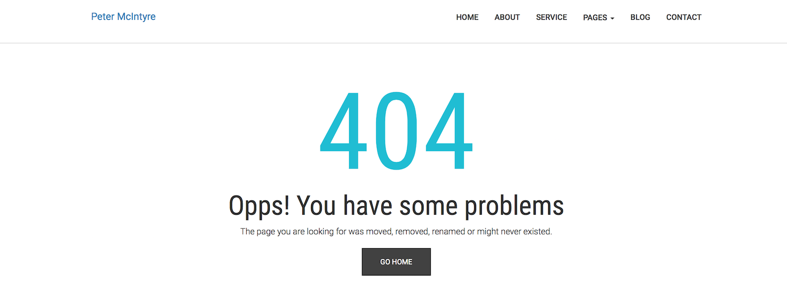

<br>
Gallery view:


<br>

Footer, at the bottom of the "contact" view:

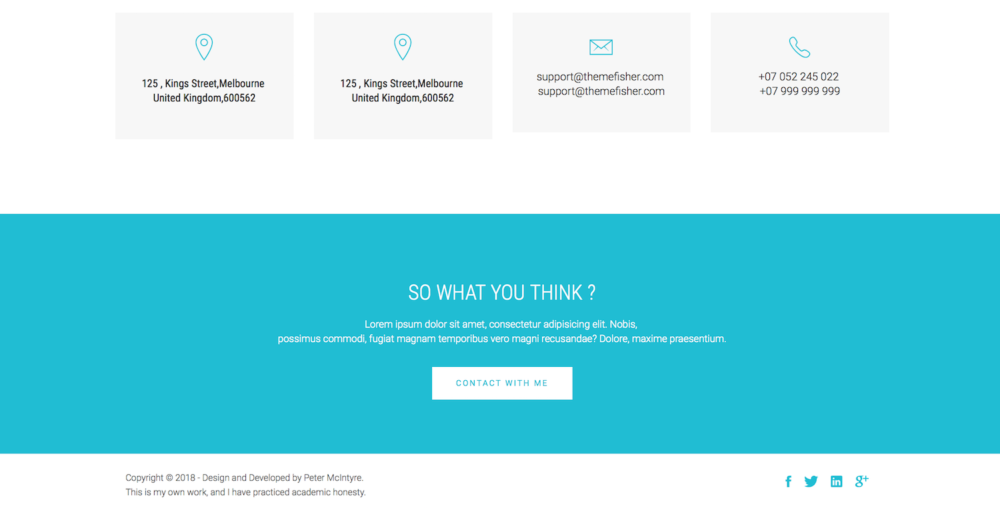

<br>

### Doing the work, project #2 (components)

As noted above, this project #2 enables you to work with local (in-memory) data and Angular components. It also enables you to begin working with *routing, services, and forms* in a very light-touch and guided manner. (Complete coverage of those topics happens in the coming weeks. )

The idea is this: 
* You will work with your Mockaroo.com generated data
* Components that implement [CRUD](https://en.wikipedia.org/wiki/Create,_read,_update_and_delete) will be configured 
* As a result, you'll get experience with components and a workflow, and get a preview of some upcoming Angular features

Above, you had created an app for project #2 (a3-project2). Get your development environment ready to work with it now. 

<br>

#### Add links to Bootstrap CSS and plugins, etc.

Edit `src/index.html`:
1. Add the Bootstrap CSS library link element (probably the CDN version) to the `<head>` element
2. Add the jQuery and Bootstrap JavaScript script elements to the *end* of the `<body>` element

Also, add `<meta>` tags for author and description, similar to those generated by the "create-react-app" generator.

<br>

#### Plan your components

As always, we will need some kind of a heading and/or navigation menu. For this app, it's OK to use only a nav menu. We will need a footer too (for your academic honesty statement). And a "not found" component.  

For content areas, we will need the following:
* home, which is a landing view 
* customers, which displays a list (table) of customers 
* customer detail, info about one customer
* customer delete, to confirm the deletion of a customer
* customer create, to add a new customer to the collection
* customer edit, to edit customer details

Use the Angular CLI to generate components for each of them now. Remember, use Pascal case names if you are using multi-word names for components. 

Then, add their selectors to the app component's HTML template so that they appear when the app loads. 

<br>

**Refine the appearance**

Before continuing, you should spend a few minutes and ensure that the appearance takes advantage of the standard Bootstrap classes (container, row, and so on). 

Where is a good place (for now) to add the container class div?

Should each component be in a row class div?

And, is this now a good time to start collecting some code and coding tips that implement some common and best practices? You can re-use some of the code you wrote in Assignments 1 and 2, and refactor it if necessary for this Assignment 3, and for future assignments. 

At this point in time, it is possible that your work may look like the following:


<br>

#### Let's get data involved 

In this assignment, we will work with data that gets created and maintained in memory. In other words, we are NOT going to work with our Teams API (or any other web service). 

Similar to Assignment 1, we will create in-memory data that was generated by Mockaroo.com. An Angular app is always stateful in the browser's memory, so for our purposes here, it is stable and permanent enough to meet the needs of Assignment 3. 

In this part of the specifications, we will provide some guidance, because some of the tasks are future-looking, so the guidance will provide the introductory coverage needed to understand, complete the work, and generate interest in future topics. Here's what we'll do:
1. Design a data / schema class that describes the shape of a customer 
2. Design a data manager "service", that will hold all customers in memory (in an array, right?), and will offer methods that handle data service operations (fetch, create, edit, etc.)

<br>

**Data / schema class**

Recently, you recreated the app that was described in the [Angular Components In-Class Demonstration](../notes/angular-components-inclass) notes. In the app, you created a data / schema class. 

Get the data that you generated from the Mockaroo.com task you did in Assignment 1. 

Generate then write a class that has all the necessary data properties for a customer. 

<br>

**Data manager "service"**

Our app has many components. Each needs access to customer data. Should we have data-handling and data-management code in each component? No!

In Angular, we can create a "service", which is a code module that can be used by many components. It is "injected" into a component during the initialization of a component, which makes the service's functionality available in the component. We have more detailed coverage of services later in the course. 

For now, generate a service:

```
ng g s DataManager --module app --spec false
```

Open its code for editing. Add an import statement for the Customer class (so that the service is aware of the shape of a customer object). 

Then, reuse some of the logic that you used in Assignment 1. 

Create a private field to hold a collection of customer objects. (This approach - creating a private field - is a fairly common pattern in services.)

```ts
private customers: Customer[];
```

Create a private method that will load the data. 

```ts
private loadCustomers() {
  this.customers = [{ "id": 1, "firstname": "Ana", "lastname": "Lawfull", "city": "Strasbourg", "email": "alawfull0@imgur.com", "website": "http://nsw.gov.au/sed/accumsan.json", "birthdate": "1996-03-19T09:05:56Z", "credits": 6938 },
// etc.
```

> Obviously, there's an alternative way to do this.  
> You could just put the code in the constructor method.  
> It's a style choice. This approach keeps the lengthy code at the bottom of the source code file. 

Finally, in the constructor, call the private load customers method. 

```ts
this.loadCustomers();
```

At this point, you have a service class that will have a collection of customer objects. How do you use this collection from a component class? There are two more things to do, one in the service class, and the other in the component class:
1. Add public methods in the service class that will return data
2. In a component class, add parameter code to the constructor method

For now, we will add one data-returning method to the service class. Then, you'll have a template or pattern to follow to meet the needs of other use cases. We'll keep it simple, for now. 

The customers component will or should display a list (table) of customer objects. Therefore, add a method that will do that, something like this:

```ts
getCustomers() {
  return this.customers;
}
```

<br>

**Using the data manager service**

As noted above, we add code to the constructor parameter in a component that will use the service. Before doing that, import the customer class and the service class. 

Then, edit the constructor method so that it looks something like this:

```ts
// Assuming that the component 
// has a property/field named "customers"...
constructor(private m: DataManagerService) {
  // Fetch the customers from the service,
  // and assign the value to the class property "customers"
  this.customers = this.m.getCustomers();
}
```

Notice the pattern in the constructor code:
* The "private" modifier is used in the parameter declaration
* Although you can use *any* name for the identifier, the professor's often uses a short name "m" for "data manager" (easy to type and remember)
* Then the type 

In this or other components, if you need different things done, then 1) add method(s) to the data manager service, and 2) call the method(s) from a component. 

After you edit the customers component HTML template, it's possible that your work will look something like this, if you're rendering the content as a table:

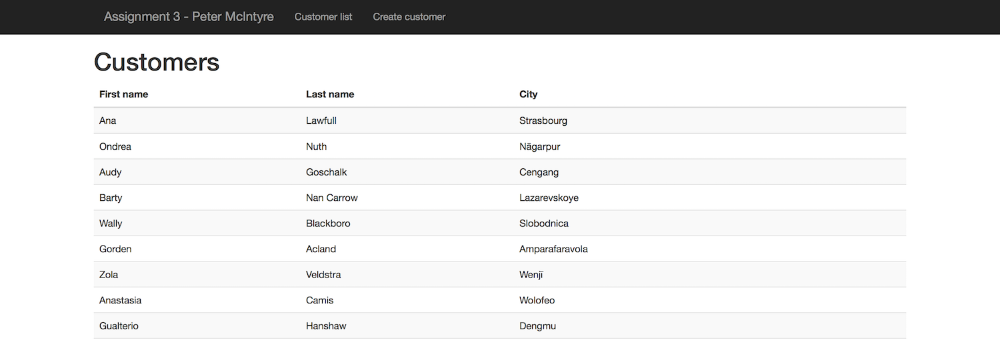

<br>

#### Brief introduction to routing

At this point in time, you have a customer list component. Recall that you also have a "home" component. Let's introduce routing, so that a browser user can display each view by clicking on links in the nav menu. 

This section is a *brief* introduction to routing, and it covers only the easy-to-do essentials. Later in the course, you will learn more about routing. Let's get started.

<br>

**Initialize routing**

When you created this project, you included the `--routing` option on the `ng new...` command. That did a few things:
1. It created an "app routing module", `app-routing.module.ts`
2. In the app module `app.module.ts`, it imported the app routing module
3. In the app component HTML template, it added a custom element, `<router-outlet>` 

<br>

**Edit the app component HTML template**

Earlier, you added the custom elements to the app component HTML template, just to make them appear in the view. 

Now, the router will do that job. So, remove the custom elements. The idea is that the router will inject/insert content from the routed component into the `<router-outlet>` element. After editing, it may look something like this:


<br>

**Add route descriptors to the app routing module**

In an Angular app, route descriptors are added to the app routing module, `app-routing.module.ts`. It has a "routes" array, which starts out empty. *We* add route descriptors to this array, to map URL segments to components. 

A route is an object ([see the docs](https://angular.io/api/router/Route)) with properties. Simple routed components need a *path* and *component* defined. Also, we always define an *empty* route, and a *not found* route.

Before defining a route to a component, make sure that you import the component into the app routing module. 

Let's start with a getting-started configuration for our project #2. (We will add a few more routes later.) The "routes" array will look something like this:


<br>

Notice a few things about the routes:
* The "home" landing page is included (makes sense, right?)
* Routes for the components that do not need any input data are defined here (later we'll add to this list)
* The sequence in which the routes appear matters - make sure that you place the *empty* route and the *not found* route at the end of the array

<br>

**Edit the nav menu**

In your recent React with routing work, you learned that the an `href` attribute was replaced with a routing-aware attribute. Same situation here. We replace the `href` attribute with a `routerLink` attribute. Here's an example:

```html
<a routerLink='/customers'>Customer list</a>
```

Notice that the path is an *absolute* path from the root of the URL space. It's probably a good idea to adopt this convention. 

Now, edit all the links in the nav menu, by replacing each `href` attribute with a `routerLink` attribute. Test your work.

<br>

**Import the Router into any component that uses routing**

In every component that uses routing (customers, customer detail, etc.), import the router:

```ts
import { Router } from '@angular/router';
```

It's also a good idea to inject it into the constructor. For example, in a component that needs both the data manager service *and* routing, the constructor could look like the following:

```ts
  constructor(
    private m: DataManagerService,
    private router: Router
  ) {
    // your constructor code goes here...
```

<br>

#### Customer "detail" component, introduction

The idea here is to enable the browser user to click (select) a row in the table, and then load a separate "customer detail" component that will display all the details. 

To get started, implement the solution in the first part of the [Select an item, view its details](https://sictweb.github.io/bti425/notes/angular-components-inclass#select-an-item-view-its-details) section of the recent notes. You want to add a click handler, and write the click hander method. For now, the click handler method can do a console log and output the selected customer object. 

What's different in this app, when compared to the in-class example? There, we rendered content on the same view. Here, we have implemented routing, and want to view a component that's dedicated to showing customer detail. We will pass information about the selected customer to the customer detail component. We do this by using a "route parameter" feature. 

<br>

**Write a new "get customer" method in the data manager service**

Return to edit the data manager service code. Write a method to find the selected customer in the data manager service (using the [array find](https://developer.mozilla.org/en-US/docs/Web/JavaScript/Reference/Global_Objects/Array/find) method), and return it to the caller.

<br>

**Update the customers list component code**

Above, you just coded a click handler to console log the selected customer object. This time, let's call the just-written data manager service method, and then *programmatically navigate* to the customer detail component. Something like this:


<br>

**Route parameter, as input data for a component**

Open the app routing module code for editing. Add a new route object to the "routes" array:

```ts
{ path: 'customerdetail/:id', component: CustomerDetailComponent },
```

Notice the format of the path. It has a *route parameter*, `/:id`. That will be a the identifier/number of the specific customer that we want to view. For example, `/customerdetail/123`. 

Earlier, you created a customer detail component. Open its code for editing. Create a property to hold the data for the specific customer that we want to view.

Import these classes. We need them to make things work. 
* Customer 
* Data manager service
* The "Router" class (from `@angular/router`)
* The "ActivatedRoute" class (also from `@angular/router`) 

We will inject the last three into the constructor too. 

Then, write the code that will 1) extract the customer identifier value from the URL parameter(s), and then 2) call into the data service to fetch the selected customer. Something like this:

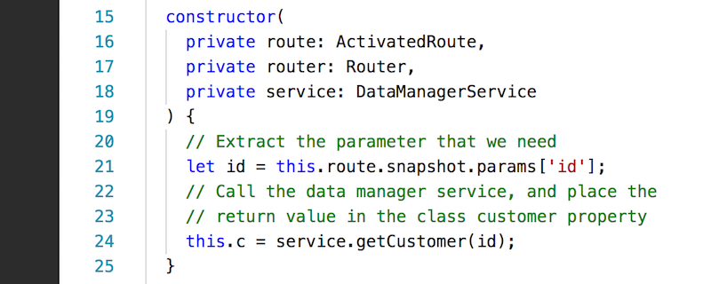

<br>

At this point in time, we have the selected customer data. Now, we want to display it. Open the customer detail component HTML template for editing. (Make sure the markup that you write is in a row class div, so that it looks OK. Also make sure the view has an info heading.)

One way of displaying the selected customer's properties is to use a [definition list](https://developer.mozilla.org/en-US/docs/Web/HTML/Element/dl) element. In the `<dl>` tag, if you use the Boostrap "dl-horizontal" class, it will render a nice side-by-side list of customer properties and values. 


<br>

It's a good idea to add a button, to navigate back to the list of customers. (Yes, the browser user could also use the "back" button.) Here's a getting-started implementation of the button markup:

```html
<button class="btn btn-default" (click)='this.router.navigate(["/customers"])'>Back to list</button>
```

Alternatively, you could put that code in a new class method, and simplify the button markup:

```html
<button class="btn btn-default" (click)='back()'>Back to list</button>
```

<br>

#### Enable the browser user to delete a customer

In this task, we will enable the browser user to delete a customer. First, we must think about and design the user interaction experience. One possible way is this:
1. A customer is selected from the list
2. It appears on the customer detail view
3. A new button enables the browser user to signal their intent to delete the customer
4. The button navigates to a new "confirm delete" view
5. When confirmed, it navigates back to the list of customers

Step 3:


<br>

Step 4:


<br>

Let's get started. 

First, make sure there's a route object defined in the app routing module. If it's needed, add it.

<br>

**Customer detail, new "delete" button**

Open the customer detail component code and HTML template for editing. Add a new "delete" button to the view. It will call a method that will ultimately navigate to the "customer delete" component. 

Then, write the method in the component class. It will navigate, passing on the customer identifier (number). You learned how to do that earlier (in the "customers" component). 

If you want a coloured (and yes, you probably do), use one of the [Bootstrap button classes](https://getbootstrap.com/docs/3.3/css/#buttons). 

<br>

**Customer delete component, and data manager service**

Remember, all data management tasks will be done by the data manager service. Therefore, write a new method that will remove a specific customer from the collection. Think about this first; it's important to know, realize, and plan to use the customer identifier, which is guaranteed to be unique, and therefore the best way to identify the customer to be deleted. 

Then, open the customer delete component code and HTML template for editing. 

The screen capture image above suggests that the appearance of this view will be similar to the "customer detail" view. Yes, that's appropriate, and makes it copy-paste then modify task. 

The component code will also have many of the same requirements as the "customer detail" code. The obvious difference is the button click handlers:
* The "back" button will navigate back to the detail view 
* The "delete" button will call the data manager service method, and then navigate back to the list of customers

<br>

#### Customer create task

First, make sure there's a route object defined in the app routing module. If it's needed, add it.

How will the browser user get to this new "customer create" view? Well, if you configured the nav menu correctly, it should already have a link to it. An additional but optional way would be to add a button to the customer list view. 

<br>

**Form create, appearance**

One way to think about this task is to ask whether we can re-use any of our previous work. Yes, it's possible. The input form can look similar to the "customer detail" view, replacing the rendered values with input text boxes. Review the "[Prepare the app...](https://sictweb.github.io/bti425/notes/angular-components-inclass#enable-editing-version-1)" section of the recent notes (and in-class demonstration) to recall this technique. 

If you do this - copy-paste from the "customer detail" view, and then replace the rendered values with input text boxes, the result may look something like this:

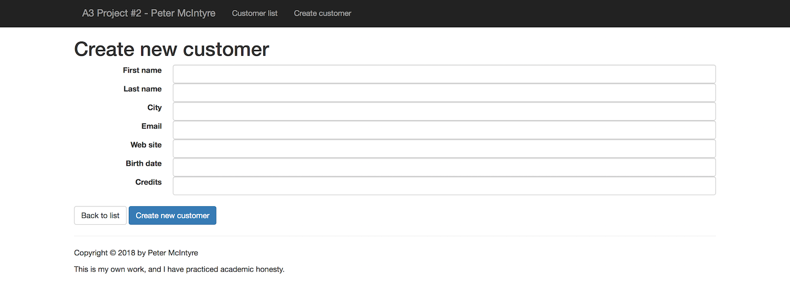

<br>

> Note:  
> It will become apparent to you that you must define and create a new and empty "customer" object in the component class.  
> As you learned from the recent notes (and in-class demonstration), Angular uses two-way data binding to persist data as it is entered into a form field.  

<br>

The appearance of the form is OK, but not great. If that annoys you (and it should), some Bootstrap classes can be added. For example:
* Wrap the entire definition list with a width-limiting column class div, to (for example) about half to two-thirds of the viewport width
* Wrap *each* dt-dd pair with a "form-group" class div

The interim result could look like this:

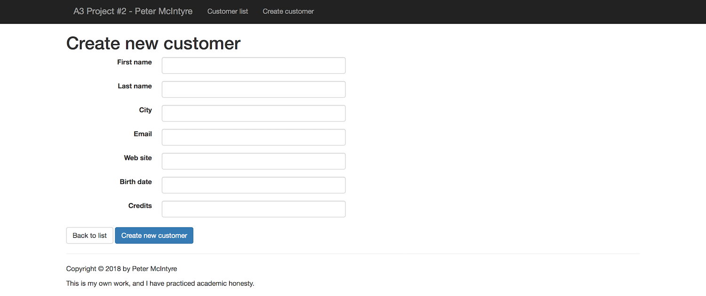

<br>

You could (should?) do a few more refinements, including:
* Focus the cursor in the first input field when the view loads
* Add placeholder text where appropriate 
* Specify the type of the input elements, to take advantage of modern browser features (validation, data type, pickers, etc.)

When you do, the result could look like this, on Safari:

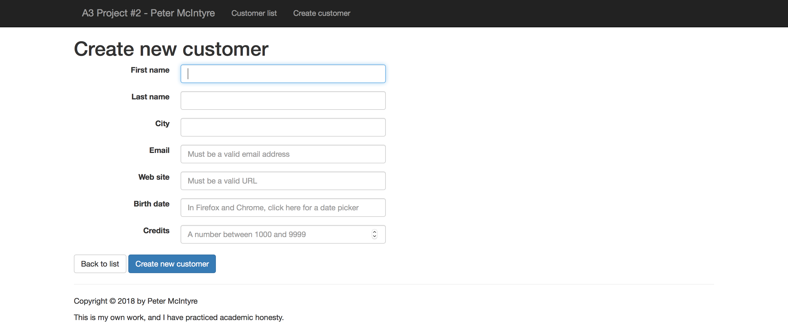

<br>

And on Firefox:

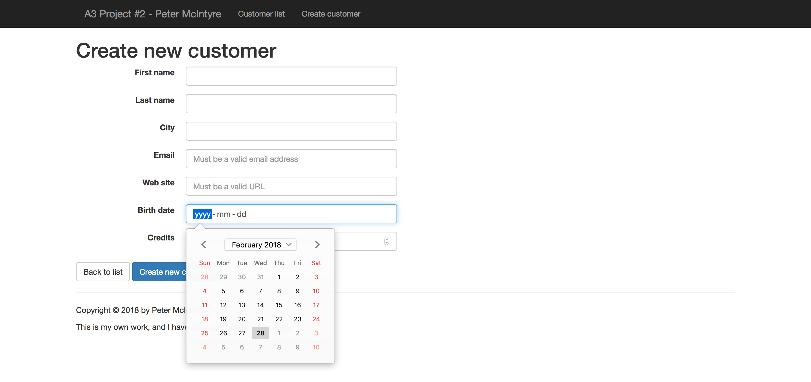

<br>

**Component coding, and data service coding**

As you did for other components, import the data manager service and routing bits, and edit the constructor. 

In the component HTML template, you probably have a couple of buttons (back, create). (If not, add them now, with each click handlers calling a method in the class.) Now, write the code for each method:
* The "back" method can simply navigate back to the customer list
* The "create" button will call a new method in the data manager service, passing in the values entered by the browser user; then, it will navigate to the customer detail component, passing along the new customer identifier value 

Code and test the "back" method now, before moving on.

Now, let's think about the tasks to be done. 

One challenge is that our data - the customer objects - is maintained in memory as an array (collection). There is no store manager (i.e. a database engine) to manage unique key values for each customer. (Remember the data was generated by the Mockaroo.com service.) When we add a new customer, we must ensure that it has a unique value for its "id" property. How?

Well, for this task, we'll just give you the code. Here's the method to add to the data service manager. It uses a new JavaScript feature, the "reduce" function. 

```ts
private getNextId() {
  // Get the maximum value for the "id" property
  let maxId = this.customers.reduce((max, c) => c.id > max ? c.id : max, this.customers[0].id);
  // Return this-plus-one 
  return maxId + 1;
}
```

Next, still in the data manager service, let's write a method that will create a customer, using these specifications:
* It must accept one parameter, which is a mostly-configured new customer object 
* Then, in the method code, call the above "getNextId" method to get the next valid identifier value 
* Assign it to the value of the "id" property in the new customer object
* Add that new customer object to the customers array (collection)
* Return the now-fully-configured new customer object

Return to the customer create component code now, because you are ready to code its "create" method. In that method, we suggest that you do the following:
* Call the data manager service, passing on the customer object
* Assign the return value to a new-and-temporary variable 
* Navigate to the customer detail component, passing on the customer identifier

Test your work. The sequence may look like the following:

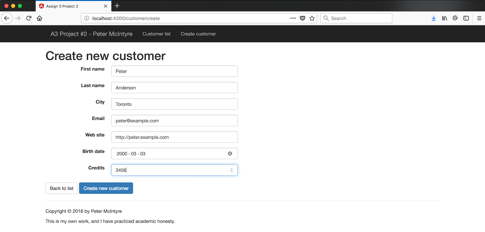

<br>

After clicking "Create new customer". Notice the URL:


<br>

After clicking "Back to list". 


<br>

#### Edit a customer

This task will blend many of the above techniques. (Copy, paste, edit, write some new code.)

As above, make sure that there is a defined route object in the app router module. As with edit and delete, it will need a parameter to hold the customer identifier. 

Next, we will need a way to activate that route. One way is to add another button (and method etc.) to the "customer detail" component. The idea is that a browser user is looking at the customer detail, and may want to edit it. 

Next, go to the data manager service. It needs a method that will enable the customer edit task. Its logic can work like the following (because we're using an in-memory array/collection):
1. Remove the old version of the customer from the array (you know how to do that from the "delete customer" task above)
2. Add the new version of the customer to the array (again, you know how to do that from the "create customer" task above)
3. Return the new version of the customer to the caller

Then, we can work with the "customer edit" component code and HTML template. As a starting point, the appearance will be similar to the "customer create" component (with changes to the heading, buttons, etc.). So, you can probably copy-paste from its HTML template. Then, edit where appropriate. It should probably have another button that enables the browser user to effectively cancel the edit task by going back to the "customer detail" component/view. 

Finally, we can edit the class code. Similar to the logic in the "create customer" task, it will call the data manager service method, and then navigate to the "customer detail" component/view. 

The result may look like the following. Assume that we're editing the first name and city (to "Peter" and "Toronto"):

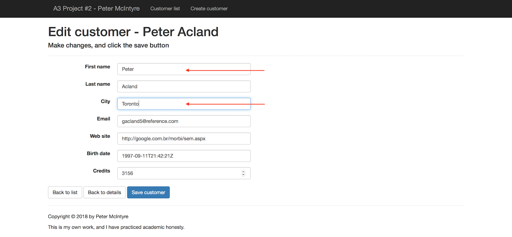

<br>

After saving, it shows the "detail" component/view:


<br>

Notice the results on the customer list:


<br>

### Testing your work

For this assignment, there is no external testing capability that can be used. 

Therefore, rely on your browser tools for this step. Soon, your professor will help you learn how to use the debugger.

<br>

### Reminder about academic honesty

You must comply with the College’s academic honesty policy.

Although you may interact and collaborate with others, you must submit your own work.

<br> 

### Submitting your work

Here’s how to submit your work, before the due date and time:

1. Locate the folder that holds both project files. 

2. Make a copy of these two folders. (You will be uploading a zipped version of the copy.)

3. Inside each project's folder, remove (delete) the `node_modules` folder. Your professor does NOT need that folder. Also, in the project #1 app, in the `src/assets` folder, remove the `images` and `plugins` folders. Your professor does NOT need those folders either. 

4. Compress/zip the copied folders. The zip file SHOULD be less than 1MB in size. If it isn’t, you haven’t followed the instructions properly.

5. Login to My.Seneca. Open the course area. Click the “Assignments” link on the left-side navigator. Follow the link for this assignment. Submit/upload your zip file. The page will accept three submissions, so if you upload, then decide to fix something and upload again, you can do so.

<br>
