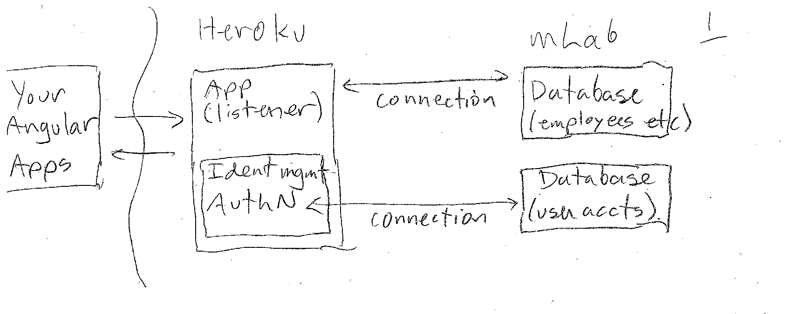
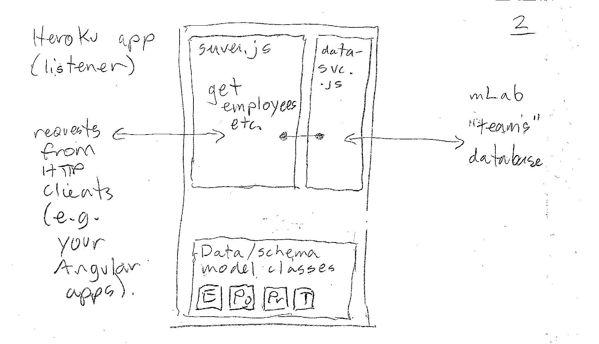
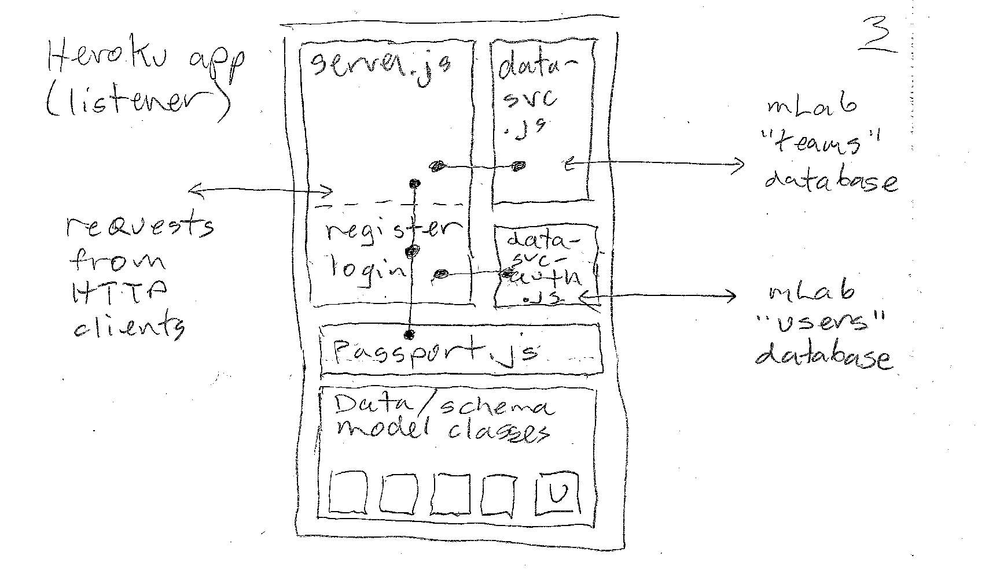

## BTI425 Assignment 6

The purpose or objective of the assignment is to add security features to an Angular app and your Teams API.

Read/skim all of this document before you begin work.

While you are doing the work, if a *specific task* is not clear, or it seems to require an unreasonable amount of time to complete, or it seems to require knowledge way beyond the content we've covered in the course, please don't hesistate to contact your professor. 

<br>

### Due Date

Sunday, April 22, 2018, at 6:00pm ET

Grade value: 10% of your final course grade

*If you wish to submit the assignment before the due date and time, you can do that.*

<p class='highlight sb'><b>The "one late privilege" rule is different for this last assignment.<br>Your professor MUST have all assignments by 6:00pm on Monday, April 23.<br>Final marks are due when the term ends the next day,<br>and there are NO "incomplete" grades in this course.</b></p>

<br>

### Introduction to the problem to be solved

In this assignment, we will add security features to your Teams API. It will support the *identity management* and *authentication* tasks. 

Then, you will create an Angular app that participates in the security features of the Teams API. It will have views to support login and user account creation, and some data views (e.g. employees or teams or whatever) will be protected, so that they are delivered to authorized users only. 

Two new-to-you technology pieces that will be learned and used in this assignment are Passport.js and JSON Web Tokens (JWT). 
* [Passport.js](http://www.passportjs.org/docs/) is authentication middleware for Node.js 
* [JWT](https://jwt.io/) is a way to represent claims securely between two parties

<br>

#### Teams API - overview diagram

It will be helpful to locate and open (for editing) your Teams API code base, as you go through this part of the document.

The following is a simplified box-and-line drawing of the new and desired Teams API app configuration. (The diagrams below were drawn quickly, to meet a publication deadline. It is likely that they will be re-drawn with colours.) As in the past, you can right-click any image and open it in its own tab/window to view it full-size.



As you can see, the left side has your Angular apps, which run in a browser on a device. The middle and right side is the Teams API app. The part that is hosted at `herokuapp.com` is the listener for requests from Angular apps. The "Database (employees etc.)" part - where the data is actually persisted - is hosted at `mLab.com`. 

<br>

#### Before changes

The next diagram has more detail about the middle "Heroku" part of the diagram above. It shows the presence, organization, and relationship of the code assets that make your Teams API work, *before we make any changes*. 



As you can see, the app - before changes - has three distinct areas:
1. `server.js`, which is the apps entry point, and listener for requests 
2. `data-service.js`, which is designed to interact with the database 
3. Data/schema model classes, which define the shape of the app's entities

Read/skim the code in `server.js`, and you will see methods like...

```js
// Get all employees
app.get("/employees", (req, res) => {

// Get one project
app.get("/project/:projectId", (req, res) => {
```

Each calls a method/function in the data service, and then returns the result as JSON (or as an error). The relationship between the server/listener and the data service is shown as a short line with solid dots at each end. 

The shape of the entities are defined in the data/schema classes (identified in the diagram as E for employee, Po for position, Pr for project, and T for team). 

<br>

#### After changes

The next diagram shows the new security code assets and their relationships. The diagram is similar to the "before changes" diagram (above), but with more boxes-and-lines.



There are several things to notice. 

First, the `server.js` code box has been enlarged to include "register" (a new account) and "login" methods. It also has new code that has a relationship to a new box of code, Passport.js. Similar to above, the relationship between the server/listener and Passport.js is shown as a short line with solid dots at each logical usage point.

Second, notice `Passport.js`. This code is now brought in to handle authentication and some identity management tasks. Also notice its dots-and-line connector, indicating a relationship between some existing methods/functions in the listener with Passport.js code. 

Third, notice a new "U" (for user accounts) data/schema model class. It defines the shape of a user account (i.e. username, password, possibly other claims such as family name, given name, birthdate, etc.). 

Finally, notice a new code box, `data-service-auth.js`. It will include methods/functions that handle the authentication heavy lifting, such as "registerUser" and "checkUser". For this assignment and this course's introductory treatment of security topics, your teacher team has decided to isolate the identity management storage part in a separate database. This also happens to be a good practice, because of the sensitive nature of a database with user account data. 

<br>

**Reminder about how-to instructions and guidance**

As first described in the previous assignment specifications, the how-to instructions in this assignment, and in future assignments, will probably be less detailed, with less guidance.  

<br> 

### Specifications overview and work plan

In our context, we must:
1. Add security features to the Teams API, and
2. Add security features to an Angular app

The first point is fully-covered in a separate document that takes you through the tasks to [add security features to the Teams API](security-add-to-server). 

[Another document](security-add-to-app) focuses on the second point, to add the essential security features to an Angular app. 

To preview its functionality, it will do a few tasks:

* Implement a "login" user interface

* After successful login, save the token in the app's memory

* Implement the code to handle the token as part of a request to a web service

* Implement the code to protect a route (in the Angular app)

* In a view, display the standard "employees" collection (protected with a "route guard")

* In a separate view, display the "employees raw" collection (which is not protected)

More details are provided below, in the section titled **"Doing the work"**.

During the Thursday classes/sessions, your professor will help you *get started* and *make progress* on the assignment. 

<br>

### Getting started

As noted above, we must:
1. Add security features to the Teams API, and
2. Add security features to an Angular app

The first point is fully-covered in a separate document that takes you through the tasks to [add security features to the Teams API](security-add-to-server). Complete that now.

Welcome back.

The [other document](security-add-to-app) focuses on the second point, to add the essential security features to an Angular app. Complete that now. 

Welcome back. 

We're done.

<br>

#### More info, Angular app (download, or create)

For this assignment, you can either use a professor-provided example app, or create a new app from scratch. Your choice. It may be easier to use the professor-provided app. 

If you choose to use a professor-provided example app, then look for it in the `Templates_and_solutions` folder of the code repository. The "assignment6-base" zip file holds the example app. Incidentally, the example app is a sample solution to the previous Assignment 5. 

After downloading the app, open a Terminal window, navigate to the project folder, and run the `npm install` command. 

If you choose to create a new app from scratch, open a terminal window, and navigate to a suitable file system location. Use the Angular CLI program to create the folder and its generated code for the project:

```
ng new assignment6 --routing -st -sg
```

After either task completes, verify that the app runs. 

Then, prepare the rest of your dev environment:
* Probably use another terminal window (so you can run code-generation commands)
* Probably use one or two Finder windows/tabs (for graphical navigation and Quick Look viewing)
* Code editor 
* Browser, and browser developer tools (at a minimum, you'll probably be using the element inspector, and the JavaScript console)
* Reference notes, including the relevant course notes (current and past), and authoritative resources (e.g. MDN, Angular documentation, etc.)

If necessary, include the Bootstrap CSS library in your app. 

Add `<meta>` tags for author and description, similar to what you've done in previous assignments. 

<br>

### Doing the work

As noted above, the [add security to an app document](security-add-to-app) focuses on adding the essential security features to an Angular app. Use that for guidance.

<br>

### Testing your work

For this assignment, there is no external testing capability that can be used. 

Therefore, rely on your browser tools for this step. Soon, your professor will help you learn how to use the debugger.

<br>

### Reminder about academic honesty

You must comply with the College’s academic honesty policy.

Although you may interact and collaborate with others, you must submit your own work.

<br> 

### Submitting your work

Here’s how to submit your work, before the due date and time:

> We must have the modified files from your Teams API.  
> More how-to-submit details soon. 

1. Locate the folder that holds your project files. 

2. Make a copy of the folder. (You will be uploading a zipped version of the copy.)

3. Inside that folder, remove (delete) the `node_modules` folder. Your professor does NOT need that folder. 

4. Compress/zip the copied folder. The zip file SHOULD be less than 1MB in size. If it isn’t, you haven’t followed the instructions properly.

5. Login to My.Seneca. Open the course area. Click the “Assignments” link on the left-side navigator. Follow the link for this assignment. Submit/upload your zip file. The page will accept three submissions, so if you upload, then decide to fix something and upload again, you can do so.

<br>
