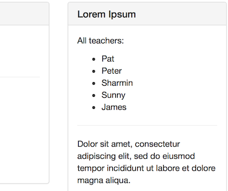
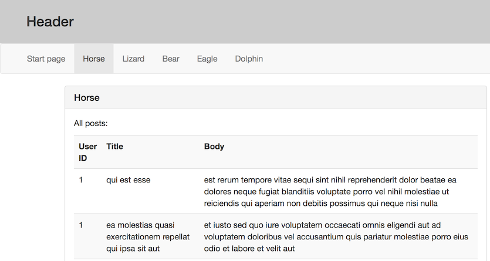
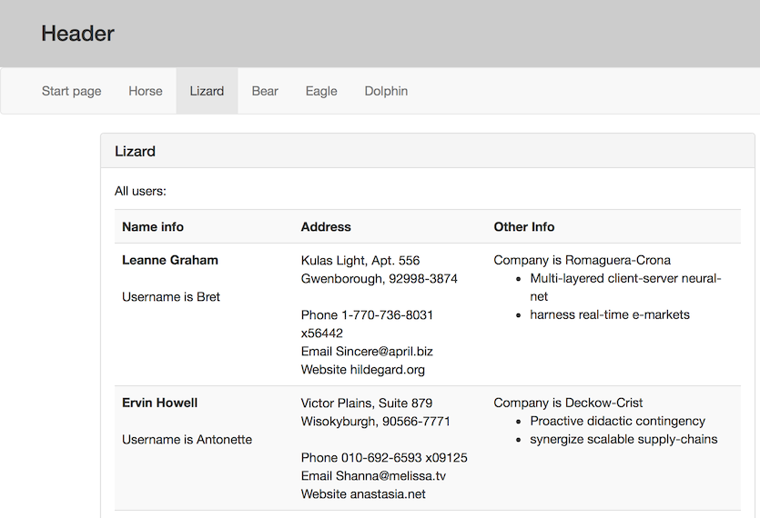

## Angular services example

In this document, you will learn how to add and use a service in an app. It's the app that was worked on in the past few weeks, as we learned more about components and routing. Here, we will make the changes to support and use services. 

<br>

### Getting started

Fetch the week 8 code example from [the course's GitHub code repository](https://github.com/sictweb/bti425). 

Using Terminal, open the ` week8 ` folder. Then, run the ` npm update ` command (or ` npm install `) to refresh the modules. 

Open the project for editing. Then, you can build and run the app. 

<br>

#### Service scenario

The first service we create will deliver a string array of names. It's a simple example, and will enable us to focus on the creation and use of a service. 

Later, we will edit the service to implement a more complex and typical scenario, to fetch data from an external source (i.e. outside our app), which will be a web service. 

<br>

#### Add a new service

In the [Adding a service to an app](angular-services-intro#adding-a-service-to-an-app) section of the "intro" notes, you learned how to add a service to an app. We used the Angular CLI:

```
ng g s DataService --module app --spec false
```

It created a new source code file, and it updated the app module. 

<br>

#### Make the new service do something

As stated above, the service's first task is to deliver a string array of names. 

In Visual Studio Code, open the service's source code file (` data-manager.service.ts `) for editing. Notice that the ` DataManagerService ` class is empty, except for a constructor stub. 

Let's do the following:
1. Add an empty string array property
2. Initialize its contents in the constructor
3. Add a function to delivery the array contents

At the end, the source code will look something like this:

```js
import { Injectable } from '@angular/core';

@Injectable()
export class DataManagerService {

  // Fields

  private teachers: string[] = [];
  
  constructor() { 
    // Load the teachers collection
    this.teachers.push('Pat');
    this.teachers.push('Peter');
    this.teachers.push('Sharmin');
    this.teachers.push('Sunny');
    this.teachers.push('James');
  }

  // Functions

  getTeachers() {
    return this.teachers;
  }

}
```

> Yes, we could have done all this work inside the ` getTeachers() ` function, but hey - we wanted to give you the typical experience of coding many members in a class. 

At this point, the code for the service is ready. Let's use it in a few components. 

<br>

#### Use the service 

The goal is to use the service in the start/home page (component) of the app. Use this pattern to configure a component to be able to use a service:
1. Add an import statement
2. Add a parameter to the constructor

Open the start/home component class file (` start.component.ts `) for editing. Add this import statement near the top:

```js
import { DataManagerService } from "./data-manager.service";
```

Add a parameter for the data manager service to the class constructor. For example: 

```js
  constructor(private m: DataManagerService) { }
```

Now we are ready to use the service's public properties and functions, anywhere in our component's code. 

<br>

##### Best practice - use the ngOnInit when appropriate

To prepare for the scenario in which we will fetch data from an external web service, we will use a *best practice* pattern. We use this pattern whenever we need to data from a service when our component loads for the first time. 

In our component class, we will need a string array property to hold the data. (Then, the property will be available in our HTML template.)

```js
  teachers: string[];
```

Then, in the `ngOnInit` function - and NOT the constructor function - we will call into the service to get the data we need for our component's new string array property. 

```js
  ngOnInit() {
    this.teachers = this.m.getTeachers();
  }
```

Soon, we will adapt this pattern even more. In this simple example, the service is delivering the data immediately, from its own state. However, a more typical scenario is that the service is fetching from an external web service, and it may take time to complete the fetch. As a result, we will adapt the pattern to recognize this asynchronous behaviour.

Back to the task at hand. At this point, our component has data in the `teachers` property. How can we render the data in the view? Open the component's HTML template (` start.component.html `) for editing. 

In the panel body div, add another element:


```html
<p>First name in the collection: {{ teachers[0] }}</p>
```


We're using simple read-only binding syntax, to extract the first element of the ` teachers ` array/collection. It should show this:


Now we can improve its appearance, by rendering *all* names in the teacher array/collection. We will use an `ngFor` *structural directive* that renders an element for each item in the collection. Replace the just-added element with this new content:


```html
    <p>All teachers:</p>
    <ul>
      <li *ngFor='let t of teachers'>
        {{ t }}
      </li>
    </ul>
```


> The use of the ` teachers ` symbol is meaningful and important:  
> It *must* match a symbol name in the component class.  
> (It does - it matches the ` teachers ` property.)

It should show this:


<br>

#### Do this work again, in another component

Let's do this work again, in another component, just to get some more practice. And to show that many components can use the same service.

Which component? It does not matter. Here/below, we will modify the "guide" (sidebar) component. 

Open the component class (` guide.component.ts `) for editing. Then:
1. Add an import statement
2. Add a parameter to the constructor
3. Add a property to hold the data
4. Fetch the data upon initialization

Then, modify the HTML template (` guide.component.html `), to render the list of names. The result:



<br>

#### Checkpoint

At this point in time, we have added, configured, and used a service in our app. In multiple components. 

The pattern is predictable:
1. Create the service
2. Add functions that deliver data (or otherwise perform data service operations)
3. In a component, configure it to use a service
4. Render whatever data you need in your component's HTML template

<br>

### Working with a web service

In the "getting started" example above, the service created its data in memory, as part of its initialization process. 

We want to add on to this functionality with another typical scenario - using a web service that's external (and outside) this app. In this section, we use a public web API that deliver simple data without fuss or muss. 

When compared to the simple "getting started" example above, there are three new or additional interrelated concepts and techniques that we are interested in:
1. HttpClient 
2. RxJS 
3. Observable

We blend all three together when working with a web service. 

<br>

#### Enable the app to use HTTP

Open the app module (` app.module.ts `) for editing. Near the top, add this import statement:

```js
import { HttpClientModule } from "@angular/common/http";
```

Then, add the ` HttpClientModule ` to the ` imports ` collection in the ` @NgModule ` decorator.

This action will enable all services in the app to use HTTP (in other words, work with a web service). 

##### Important Note

When trying to use **HttpClient** anywhere else in your application (e.g. a ` whatever.service.ts ` file), be sure to *import* ***HttpClient*** (and not HttpClientModule) into that service or component. For example:

```js
import { HttpClient } from "@angular/common/http";
```

<br>

#### Visit and browse the web service

For the following, we could use our Teams API. Just to be different and flexible, we'll use a different web service. 

A programmer with the moniker *typicode* has published a small-size web service named "JSONPlaceholder". Open Postman (or JSON Formatter), and look at the results from these URLs:

`http://jsonplaceholder.typicode.com/posts`

`http://jsonplaceholder.typicode.com/users`

`http://jsonplaceholder.typicode.com/comments`

All return an array/collection of data. 

<br>

#### Write view model classes to match the data

Now, write *view model* classes to match the data returned by the first two URLs above. We must do this when working with web services. Here's how:

Create a new source code file named ` vm-typicode.ts `. Its name suggests that this source code file will define "view models for the typicode web service". In it, we will write several classes, which will allow us to work with "posts", "users", and "comments":

```js
// View models for the typicode.com web service

export class Post {
    id:         number;
    userId:     number;
    title:      string;
    body:       string;
}

export class Comment {
    id:         number;
    postId:     number;
    email:      string;
    name:       string;
    body:       string;
}

export class Geo {
    lat:        number;
    lng:        number;
}

export class Address {
    city:       string;
    geo:        Geo;
    street:     string;
    suite:      string;
    zipcode:    string;
}

export class Company {
    bs:             string;
    catchPhrase:    string;
    name:           string;
}

export class User {
    address:        Address;
    company:        Company;
    email:          string;
    id:             number;
    name:           string;
    phone:          string;
    username:       string;
    website:        string;
}
```

<br>

#### Prepare the service

Open the service for editing. Add the following near the top:

```js
import { Observable } from "rxjs/Observable";

import { Post, Comment, Geo, Address, Company, User } from "./vm-typicode";
```

We need `Observable`, because that's the type of the web service get/fetch result. 

We need the view model classes to enable the model binder to correctly create the arrays/collections. 

<br>

##### Suggestion - create a "url" string field

Suggestion - create a "url" string field, to hold the long and constant part of the URL to the web service. Doing this will make it easy to create a concatenated string that includes the segment we want. 

```js
  private url = "http://jsonplaceholder.typicode.com";
```

<br>

##### Write a function for each web service resource

Write a function for each web service resource that the app needs. Assume, as noted above, that we want posts, comments, and users.

```js
  getPosts(): Observable<Post[]> {
    return this.http.get<Post[]>(`${this.url}/posts`)
  }

  getComments(): Observable<Comment[]> {
    return this.http.get<Comment[]>(`${this.url}/comments`)
  }

  getUsers(): Observable<User[]> {
    return this.http.get<User[]>(`${this.url}/users`)
  }
```
<br>

#### Use the new function(s) in the service

Let's do the work in a different component, "horse". We'll just push the existing content down. Open the horse component class (` horse.component.ts `) for editing. 

Import the service. 

Import the view model class. Let's work with posts, so we need the Post class imported. 

Inject the service into the constructor. 

Create a field to hold the content we want; it will be a Post array/collection field. 

Add a function that will call the service.

We want to call this function when the component is loaded/initialized, so do that in the ngOnInit function code. 

Finally, open the HTML template (` horse.component.html `) for editing. We want to push the existing content down. So, in the panel body, add these elements to the top:


```html
    <p>All posts:</p>
    <table class="table table-striped">
      <tr>
        <th>User ID</th>
        <th>Title</th>
        <th>Body</th>
      </tr>
      <tr *ngFor='let p of posts'>
        <td>{{p.userId}}</td>
        <td>{{p.title}}</td>
        <td>{{p.body}}</td>
      </tr>
    </table>
    <hr>
```


The result should look like this:



<br>

#### Do it again

Do it again, to the lizard component. Show the users resource, and push the existing content down.

The result should look like this:



<br>

### Summary

In this document, you learned an incremental approach to creating and using a service. 

We started by delivering static data that was created in the service. 

Then, we got the more typical web service scenario involved, and learned a reliable and repeatable way to implement a very common scenario. 

<br>
