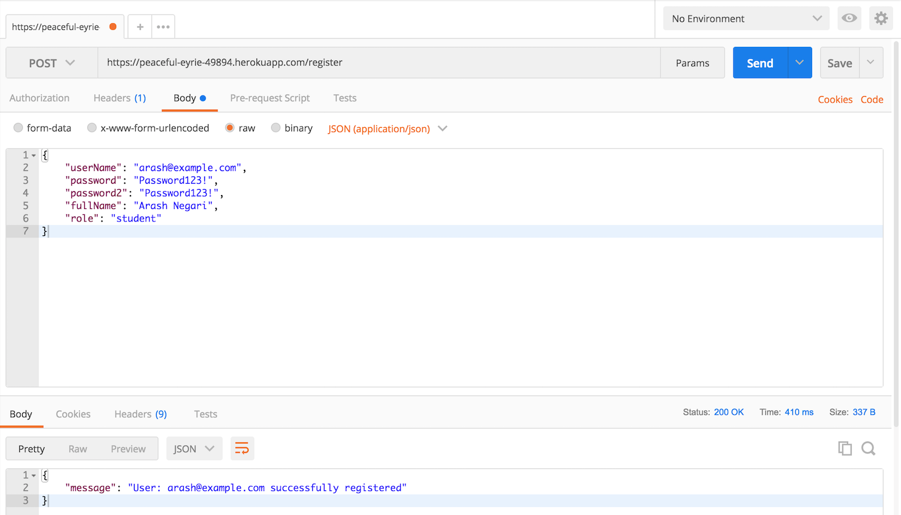
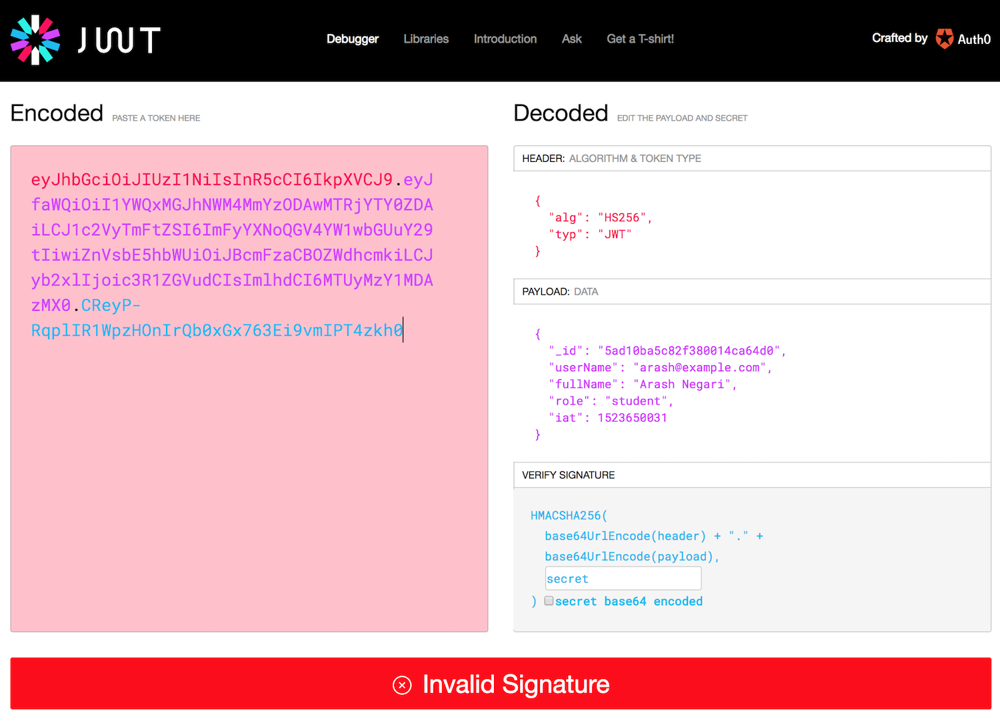
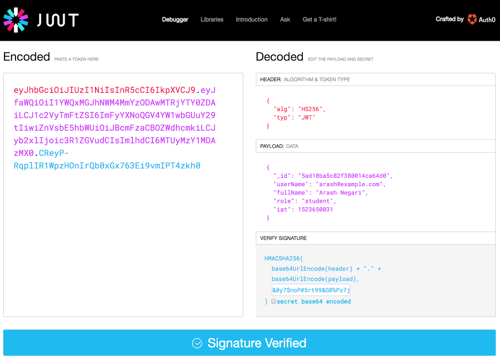
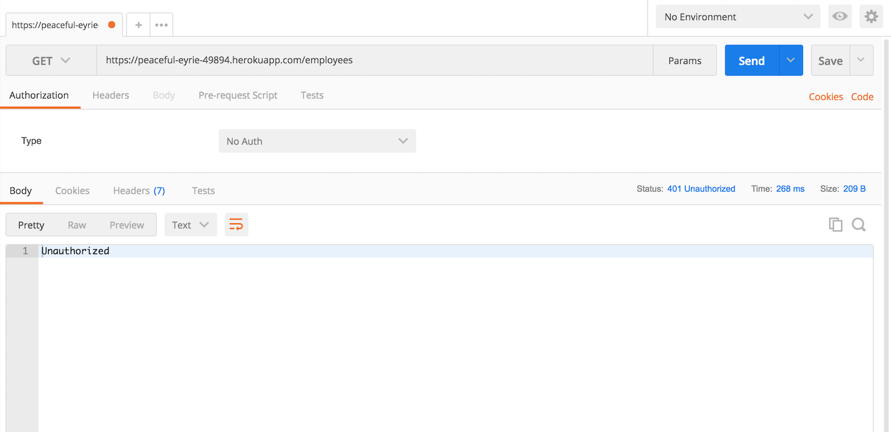

## Add security features to web service

After learning something about [security topics](security-intro), we are ready to write some code. 

In our context, we must:
1. Add security features to the Teams API, and
2. Add security features to an Angular app

This document focuses on the first task, adding security features to the Teams API. 

 

### Prepare to work on your Teams API

### Testing

Postman

Register a new user account, for the "user account manager", headers

 

Body

 

Response

 

Another register

 

 

Login a user

 

Decode the token, initial paste 

 

After supplying the secret

 

Requesting `/employees` without a token

 

Configuring the token in the authorization header

 

Requesting `/employees` WITH a token

 
