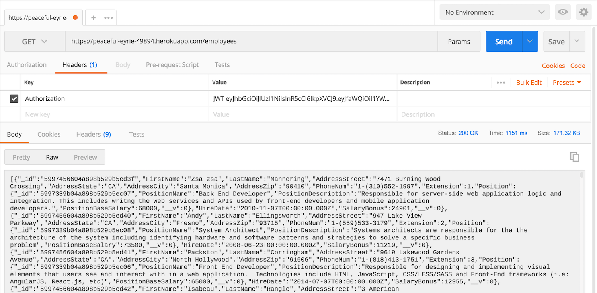

## Add security features to web service

After learning something about [security topics](security-intro), we are ready to write some code. 

In our context, we must:
1. Add security features to the Teams API, and
2. Add security features to an Angular app

This document focuses on the first point, adding security features to the Teams API. A [separate document](security-add-to-app) focuses on the second point. 

The following is a simplified box-and-line drawing of the new and desired Teams API app configuration. It shows the new security-related code assets and their relationships.

There are several things to notice. 

First, the `server.js` code box has been enlarged to include "register" (a new account) and "login" methods. It also has new code that has a relationship to a new box of code, Passport.js. Similar to above, the relationship between the server/listener and Passport.js is shown as a short line with solid dots at each logical usage point.

Second, notice `Passport.js`. This code is now brought in to handle authentication and some identity management tasks. Also notice its dots-and-line connector, indicating a relationship between some existing methods/functions in the listener with Passport.js code. 

Third, notice a new "U" (for user accounts) data/schema model class. It defines the shape of a user account (i.e. username, password, possibly other claims such as family name, given name, birthdate, etc.). 

Finally, notice a new code box, `data-service-auth.js`. It will include methods/functions that handle the authentication heavy lifting, such as "registerUser" and "checkUser". For this course's introductory treatment of security topics, your teacher team has decided to isolate the identity management storage part in a separate database. This also happens to be a good practice, because of the sensitive nature of a database with user account data. 

The work described below has four major tasks:
1. Prepare your Heroku and mLab deployments
2. Add a teacher-provided code module
3. Write a user account schema 
4. Edit `server.js` 

 

### Prepare your Heroku and mLab deployments

In this task, there are two sub-tasks to be done:
1. Ensure that you can update your Heroku deployment
2. Create a new mLab deployment

 

#### Ensure that you can update your Heroku deployment

Almost three months ago, you deployed your Teams API to Heroku (and created an mLab database). If you have not periodically or regularly updated the Heroku deployment, we *strongly recommend* doing an update, before continuing with the remaining work below. 

The idea is to make a minor change to `server.js` that does not affect its functionality. For example, do a code reformat, or add a blank line or two, or a code comment somewhere. Again, the idea is to make a change and *successfully* "push" it to Heroku. 

First, locate and open (for editing) your Teams API code base. If you have not changed it since it was deployed in January, the Source Control tool (in Visual Studio Code) should be clean (i.e. no changed items yet). 

Next, make a minor change to `server.js` as described above. 

Finally "push" it to Heroku. If you want to review a summarized reminder of the overall deployment procedure, [read this section](https://sictweb.github.io/bti425/notes/teams-api-setup#creating-a-minimal-server-app-that-can-be-hosted-at-heroku) of the Teams API Setup document. That section and the next two sections will be useful. (And, if it's not enough, you can always go back to the [Teams API README](https://github.com/sictweb/bti425/blob/master/Templates_and_solutions/teams-api/README.md) on the code repository.)

 

#### Create a new mLab deployment

Assuming the task above was successful, we can continue with this task. 

As noted above, we want to create a separate database to hold the user accounts. Therefore, we must create another mLab deployment. If you want to review a summarized reminder of the overall procedure, [read this section](https://sictweb.github.io/bti425/notes/teams-api-setup#working-with-mlab) of the Teams API Setup document. 

Save (and note) your credentials, and the MongoDB connection string. We will need that soon. 

 

### Add a teacher-provided code module

 

### Write a user account schema 

 

### Edit `server.js` 

Big picture:
* Prep the Heroku and mLab deployments
* Add in the auth code
* Add a user account schema
* Edit server.js

Locate your Teams API code base  
Make a small change to the code base, and push it  
Create a new mLab deployment  
User account schema, [how-to link](http://mongoosejs.com/docs/schematypes.html#schematype-options)  

### Testing

Postman

Register a new user account, for the "user account manager", headers

 

Body

 

Response

 

Another register

 

 

Login a user

 

Decode the token, initial paste 

 

After supplying the secret

 

Requesting `/employees` without a token

 

Configuring the token in the authorization header

 

Requesting `/employees` WITH a token

 
